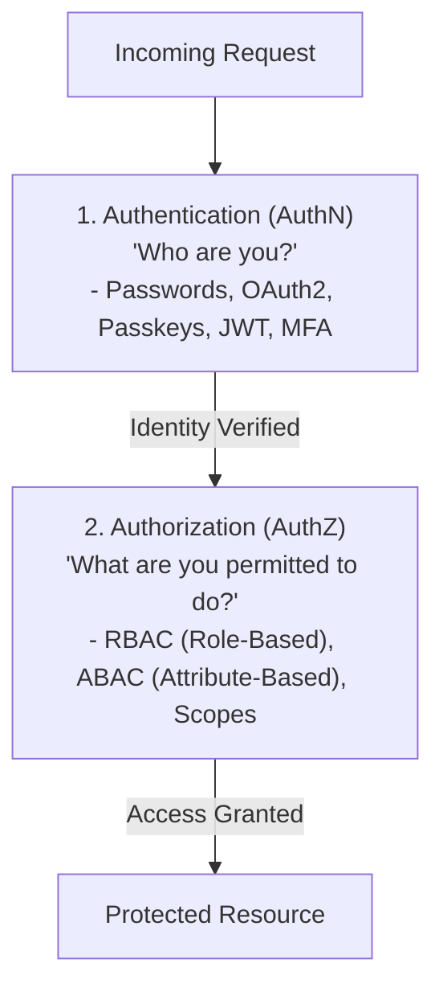
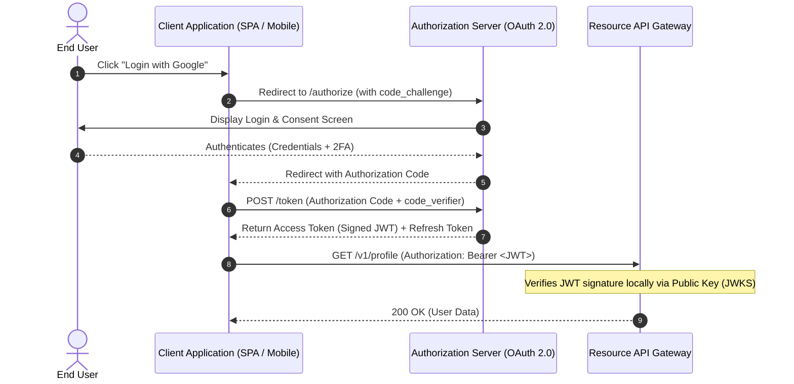
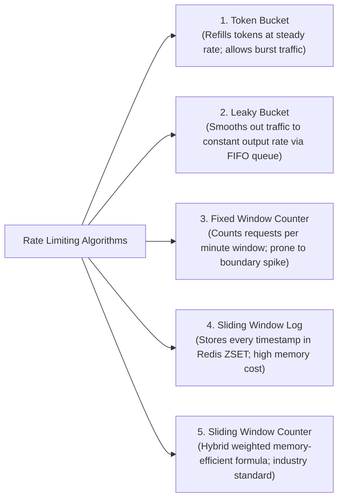
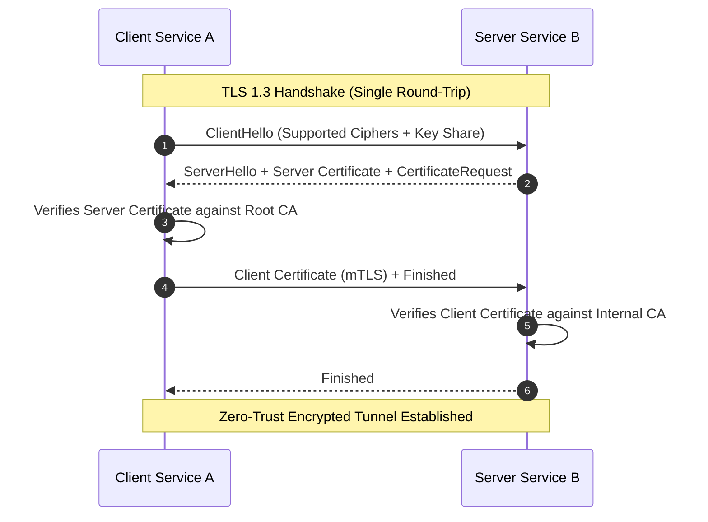

# 11 — Security & Rate Limiting

## 🛡️ 1. Authentication (AuthN) vs Authorization (AuthZ)

---

## 🔑 2. OAuth 2.0 Flow with PKCE & JSON Web Tokens (JWT)

### Anatomical Structure of a JWT:
$$\mathbf{\text{JWT}} = \underbrace{\text{Base64(Header)}}_{\text{Algorithm: RS256}} \,.\, \underbrace{\text{Base64(Payload)}}_{\text{sub, exp, iss, roles}} \,.\, \underbrace{\text{Signature}}_{\text{Encrypted Hash with Private Key}}$$

- **RS256 (Asymmetric)**: Auth server signs token with Private Key; API Gateways verify using cached Public Key without calling Auth DB!

---

## 🚦 3. Rate Limiting Algorithms Deep Dive

Rate limiting protects APIs from abuse, credential stuffing, and DDoS outages.

### Algorithm Comparison Matrix:

| Algorithm | Handles Bursts? | Memory Footprint | Accuracy | Industry Standard Use Case |
|---|---|---|---|---|
| **Token Bucket** | ✅ Yes (Up to bucket capacity) | 🟢 $O(1)$ (Tokens + Last Refill Time) | High | AWS API Gateway, Stripe API |
| **Leaky Bucket** | ❌ No (Smooths to fixed rate) | 🟡 $O(\text{Queue Size})$ | High | Traffic shaping, E-commerce checkouts |
| **Fixed Window** | ❌ No ($2\times$ burst at edges) | 🟢 $O(1)$ (Simple integer counter) | 🔴 Low (Edge spike vulnerability) | Simple non-critical rate limits |
| **Sliding Window Counter**| ✅ Yes | 🟢 $O(1)$ (Only 2 numbers: Prev & Curr count)| 🟢 $99.9\%$ | Cloudflare, Envoy, Redis Lua scripts |

---

## 🔒 4. SSL/TLS & Mutual TLS (mTLS)

- **mTLS (Mutual TLS)**: Both client and server authenticate each other using X.509 digital certificates, ensuring Zero-Trust internal microservice communication.
