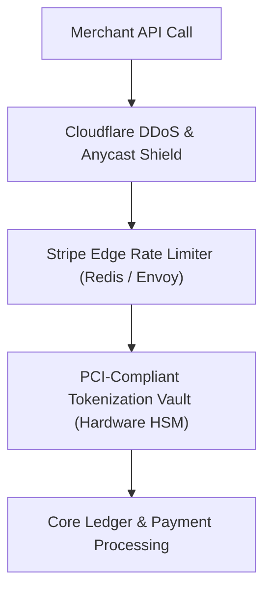

# Case Study: Stripe's API Security, Tokenization & Multi-Tier Rate Limiting

## 🏢 Context: Securing Billions in Financial Transactions

As the financial infrastructure for the internet, Stripe handles trillions of dollars. A single security breach or rate limiter misconfiguration could paralyze global e-commerce.

---

## 🛠 Engineering Security Innovations

### 1. Zero-Knowledge Credit Card Tokenization (PCI-DSS)
- Raw credit card numbers (PANs) **never touch Stripe's main application servers or primary databases**.
- Credit card inputs are tokenized directly from the user's browser iframe into an isolated, physically segregated **PCI-DSS Level 1 Vault**.
- The main application only receives an opaque, cryptographically signed token (`tok_1N4xyz98`), eliminating data leak risks across 99% of Stripe's microservices.

### 2. Multi-Tier Distributed Rate Limiting
Stripe deploys 4 distinct tiers of rate limiting:
1. **Request Rate Limiter**: Limits requests per API key (e.g., 100 req/sec) using the **Token Bucket** algorithm in Redis.
2. **Concurrent Request Limiter**: Prevents long-running reports from hogging database connections (e.g., max 25 simultaneous queries).
3. **Usage-Based Limiter**: Flags accounts displaying bot-like scraping patterns.
4. **Critical Path Priority**: When under extreme load, webhooks and read queries are throttled while critical `/v1/charges` payment requests are given guaranteed processing priority.

### 3. Idempotency Key Guarantees
- Every payment request mandates an `Idempotency-Key` header.
- If a network dropout occurs after charging a customer, the merchant retries the exact same request.
- Stripe returns the cached payment receipt from Redis/Postgres without charging the customer's credit card twice.

---

## 📊 Summary of Security Metrics

| Layer | Traditional Web App | Stripe Financial Infrastructure |
|---|---|---|
| **Card Data Storage** | Stored in standard DB (Vulnerable) | Isolated HSM Vault + Opaque Tokenization |
| **API Auth Verification** | DB query per request | Stateless Public Key Cryptography (JWKS / Ed25519) |
| **Network Security** | Perimeter firewall only | Full Zero-Trust Mutual TLS (mTLS) across all pods |
