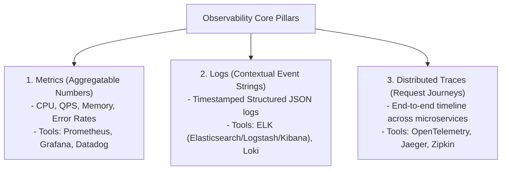
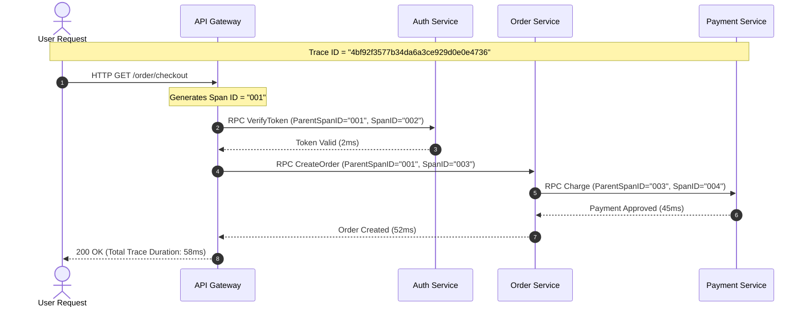
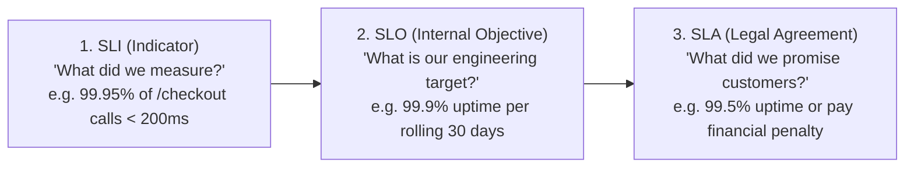
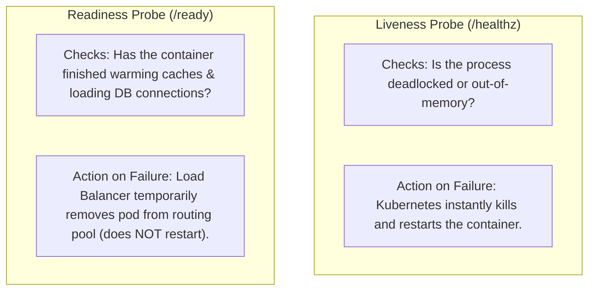

# 12 — Observability & Monitoring

## 🔭 1. The Three Pillars of Observability

In complex distributed architectures with hundreds of microservices, traditional single-server debugging is impossible. Observability provides insight into why a system is broken based on its external telemetry data.

---

## 🧭 2. Distributed Tracing: Trace ID, Span ID & W3C Context

How do we follow a single user request across 20 distinct microservices?

- **Trace ID**: A globally unique identifier for the entire request path across all services.
- **Span ID**: Represents an individual unit of work executed by a single service (includes start time, end time, tags, and logs).
- **W3C Trace Context Header (`traceparent`)**: Standard HTTP header format: `version-trace_id-parent_id-trace_flags`.

---

## 🎯 3. SLA vs SLO vs SLI & Error Budgets

### The Error Budget Concept
$$\text{Error Budget} = 100\% - \text{SLO}$$

- If an SLO is **99.9%** availability over 30 days, the team has an **Error Budget of 0.1%** ($\approx 43.8\text{ minutes}$ of acceptable downtime).
- **Rule of Thumb**:
  - If Error Budget is positive: Teams can ship new experimental features and deploy rapidly.
  - If Error Budget is exhausted: Feature freezes are enforced; 100% of engineering bandwidth switches to reliability and bug fixing.

---

## 🩺 4. Health Checks: Liveness vs Readiness Probes

In container orchestration platforms (Kubernetes), two distinct health probes prevent traffic from hitting broken or initializing pods:

