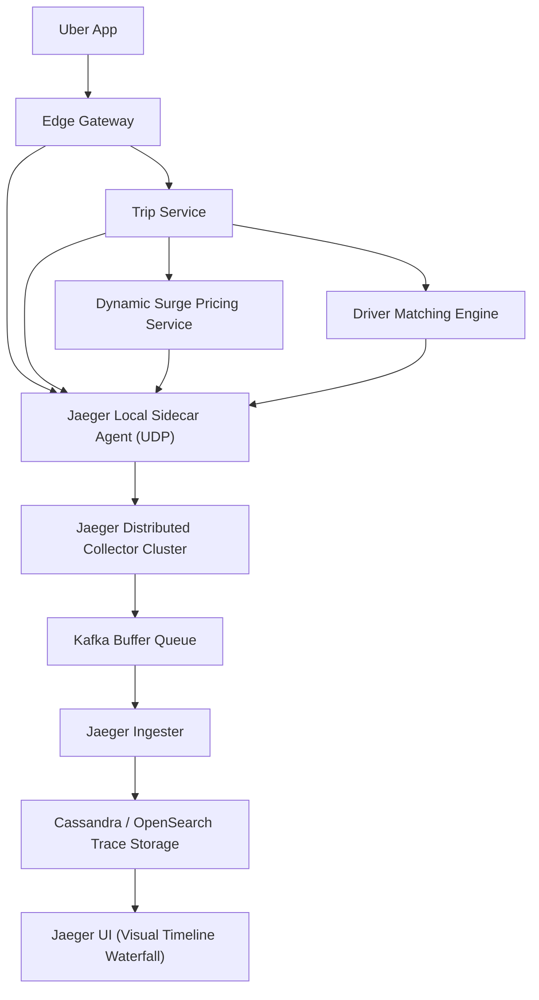

# Case Study: Distributed Tracing at Uber (The Creation of Jaeger)

## 🏢 Context: Diagnosing p99 Latency Across 2,000 Microservices

When an Uber user pressed "Request Ride", the API request touched over 1,500 distinct microservices within 500 milliseconds. When a request timed out or experienced high tail latency (p99 > 2s), developers spent hours inspecting disconnected logs across dozens of server clusters without knowing which service caused the delay.

---

## 🛠 Engineering Innovations

### 1. Creation of Jaeger (CNCF Graduated Project)
Uber engineered and open-sourced **Jaeger** to provide distributed tracing across Go, Java, Python, and Node.js fleets:
- **Automatic Context Propagation**: Injects `uber-trace-id` headers into all outgoing HTTP and gRPC network requests.
- **Out-of-Process Async Telemetry**: Telemetry spans are pushed via local UDP sockets to a co-located Jaeger sidecar agent, ensuring zero latency impact on production user traffic.

### 2. Adaptive Sampling
- **The Scale Problem**: Storing 100% of traces for billions of trips would generate hundreds of terabytes of telemetry data daily.
- **The Solution**: Uber built **Adaptive Dynamic Sampling**:
  - Automatically samples 0.1% of healthy successful requests.
  - Automatically ramps up sampling to 100% for error requests (HTTP 5xx) and high-latency p99 traces.

---

## 📊 Summary of Observability Gains

| Dimension | Disconnected Server Logs | Jaeger Distributed Tracing |
|---|---|---|
| **Root Cause Detection Time** | 4 to 8 hours of manual grep | **< 3 minutes** via visual waterfall trace view |
| **Cross-Service Dependency Map** | Outdated static architectural wiki diagrams | Dynamically auto-generated live dependency graphs |
| **Performance Overhead** | Heavy disk I/O from log statements | < 0.5% CPU overhead via UDP async telemetry |
