# 13 — Best Practices, Capacity Estimation & Math Cheat Sheet

## 🔢 1. Back-of-the-Envelope Math Cheat Sheet

During a System Design interview, candidates must rapidly estimate QPS, storage, bandwidth, and memory without a calculator.

### ⏱️ Time Approximations
- $1 \text{ Minute} = 60 \text{ seconds}$
- $1 \text{ Hour} = 3,600 \text{ seconds}$
- $1 \text{ Day} = 86,400 \text{ seconds} \approx \mathbf{10^5 \text{ seconds (100k seconds for rapid mental math)}}$
- $1 \text{ Month} \approx 2.5 \times 10^6 \text{ seconds}$
- $1 \text{ Year} = 3.15 \times 10^7 \text{ seconds} \approx \mathbf{3 \times 10^7 \text{ seconds}}$

---

### ⚡ QPS Rule of Thumb Conversions

$$\text{Average QPS} = \frac{\text{Total Requests per Day}}{86,400 \text{ (or 100,000 for fast estimation)}}$$

$$\text{Peak QPS} = \text{Average QPS} \times 2 \quad (\text{or } 3\times \text{ for traffic bursts})$$

| Daily Request Volume | Mental Math Formula | Exact Average QPS | Peak QPS ($2\times$) |
|---|---|---|---|
| **1 Million / day** | $10^6 / 10^5$ | **12 QPS** | **24 QPS** |
| **10 Million / day** | $10^7 / 10^5$ | **116 QPS** | **230 QPS** |
| **100 Million / day** | $10^8 / 10^5$ | **1,160 QPS** | **2,320 QPS** |
| **1 Billion / day** | $10^9 / 10^5$ | **11,600 QPS** | **23,200 QPS** |

---

### 💾 Data Size Approximations (Powers of 2 vs 10)

| Power of 2 | Exact Bytes | Decimal Value | Unit |
|---|---|---|---|
| $2^{10}$ | 1,024 Bytes | $\approx 10^3$ | **1 KB** (Kilobyte) |
| $2^{20}$ | 1,048,576 Bytes | $\approx 10^6$ | **1 MB** (Megabyte) |
| $2^{30}$ | 1,073,741,824 Bytes | $\approx 10^9$ | **1 GB** (Gigabyte) |
| $2^{40}$ | 1,099,511,627,776 Bytes | $\approx 10^{12}$ | **1 TB** (Terabyte) |
| $2^{50}$ | 1,125,899,906,842,624 Bytes | $\approx 10^{15}$ | **1 PB** (Petabyte) |

---

### ⚡ Latency Numbers Every Engineer Should Know (Jeff Dean Benchmark)

```mermaid
gantt
    title Hardware Latency Scale Visualizer (Logarithmic)
    dateFormat X
    axisFormat %s
    section Memory
    L1 Cache Reference (0.5 ns)       :0, 1
    Main Memory / RAM Access (100 ns) :0, 100
    section Storage
    NVMe SSD Random Read (100 us)     :0, 100000
    Rotational HDD Disk Seek (10 ms)  :0, 10000000
    section Network
    Same Datacenter RTT (500 us)      :0, 500000
    Cross-Continental RTT (150 ms)    :0, 150000000
```



| Operation | Latency (Human Scale Analogy) |
|---|---|
| **L1 CPU Cache Reference** | **0.5 ns** (1 heart beat) |
| **Main Memory (RAM) Reference** | **100 ns** (2 minutes) |
| **Read 1 MB sequentially from RAM** | **3,000 ns (3 µs)** |
| **Read 1 MB sequentially from NVMe SSD** | **200,000 ns (200 µs)** |
| **Rotational HDD Seek** | **10,000,000 ns (10 ms)** (1 year!) |
| **Round Trip inside same Datacenter** | **500,000 ns (0.5 ms)** |
| **Round Trip from California to Netherlands** | **150,000,000 ns (150 ms)** |

---

## 🧠 2. Cache Memory Sizing: The 80/20 Pareto Rule

In system design interviews, apply the **80/20 Pareto Principle**: **80% of daily read requests access 20% of the daily active data**.

$$\text{Cache RAM Required} = \text{Daily Total Read Volume (Bytes)} \times 20\%$$

### Example:
- If an application generates **500 GB of daily read data**:
- Cache RAM = $500 \text{ GB} \times 0.20 = \mathbf{100 \text{ GB of RAM}}$.
- A single AWS `r5.xlarge` instance (32GB) or a cluster of 4 nodes easily accommodates this in Redis!

---

## ⚖️ 3. Master Trade-Off Matrix

```
+---------------------------+---------------------------+-----------------------------------+
| Design Choice             | Pros                      | Cons / Trade-offs                 |
+---------------------------+---------------------------+-----------------------------------+
| SQL vs NoSQL              | ACID, Complex JOINs       | Hard to scale writes horizontally |
| Write-Through vs Aside    | Warm cache, zero miss     | Higher write latency              |
| Fan-out on Write          | Instant timeline read     | Celebrity hotkey write bottleneck |
| Push vs Pull (Streaming)  | Real-time, low latency    | High persistent connection count  |
| Asymmetric vs Symmetric   | Zero-DB JWT validation    | Token revocation is challenging   |
+---------------------------+---------------------------+-----------------------------------+
```
