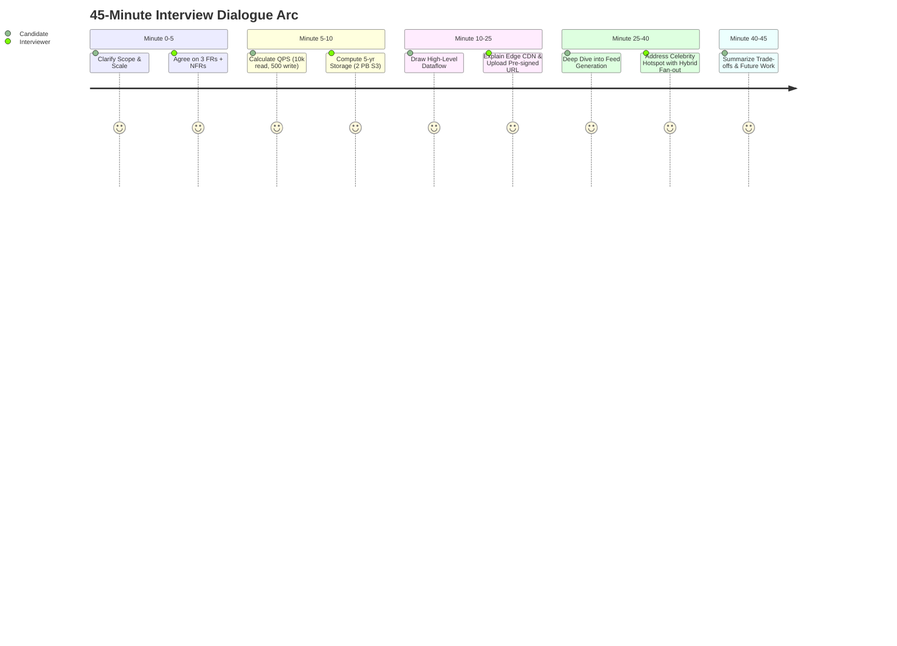

# Case Study: End-to-End Execution of a 45-Minute Senior Interview

## 🏢 Context: Live Transcript of a Top-Score Interview

This case study breaks down how an L5/Senior candidate systematically structures the 45-minute dialogue when asked: *"Design a Globally Distributed Image Sharing Platform"*.

---

## 🎯 The Candidate's 6-Phase Dialogue Playbook

### Phase 1: Clarify Scope (0–5 mins)
- **Candidate**: "Before jumping into the design, I'd like to clarify the core requirements. For functional scope, should we focus on: 1) Uploading images, 2) Viewing user profiles, and 3) Generating a home timeline feed?"
- **Interviewer**: "Yes, that is perfect. Search and comments are out of scope."
- **Candidate**: "For non-functional requirements: We need high availability (99.99%), low read latency (< 100ms for feed load), and eventual consistency for photo uploads. Scale target: 100M DAU."

### Phase 2: Capacity Estimation (5–10 mins)
- **Candidate**: "Let's assume each DAU views 20 photos and uploads 1 photo daily.
  - Write QPS = $100\text{M} / 10^5 \approx 1,000 \text{ uploads/sec}$ (Peak $2,000$).
  - Read QPS = $2 \text{Billion} / 10^5 \approx 20,000 \text{ reads/sec}$ (Peak $40,000$).
  - Image size average = 2 MB. Daily storage = $100\text{M} \times 2\text{ MB} = 200 \text{ TB/day}$.
  - 5-Year Storage = $200 \text{ TB} \times 365 \times 5 \approx 365 \text{ PB}$.
  - We clearly need distributed Object Storage (Amazon S3 / GCS) + CDN edge caching for media assets."

### Phase 3: High-Level Architecture (10–25 mins)
- The candidate draws the high-level architecture: CDN, API Gateway, Upload Service, Timeline Service, Redis Feed Cache, S3 Bucket, and Sharded Postgres/Cassandra metadata DB.
- Explains **Direct S3 Pre-signed URL Uploads** to prevent large binary files from overloading the application microservices tier.

### Phase 4: Deep Dive on Bottlenecks (25–40 mins)
- **Interviewer**: "What happens when a celebrity with 50M followers uploads a photo?"
- **Candidate**: "That is the classic Fan-out Write Bottleneck. We mitigate it with a **Hybrid Feed Model**:
  - Regular users use Fan-out on Write (push to followers' Redis timeline cache).
  - Celebrities use Fan-out on Read (their post is merged dynamically into follower timelines at query time). This eliminates write latency spikes."

### Phase 5: Wrap-up & Trade-offs (40–45 mins)
- Summarizes the CAP theorem choice (AP with eventual consistency), monitoring strategy (Jaeger tracing and Prometheus p99 latency alerts), and future optimizations.
