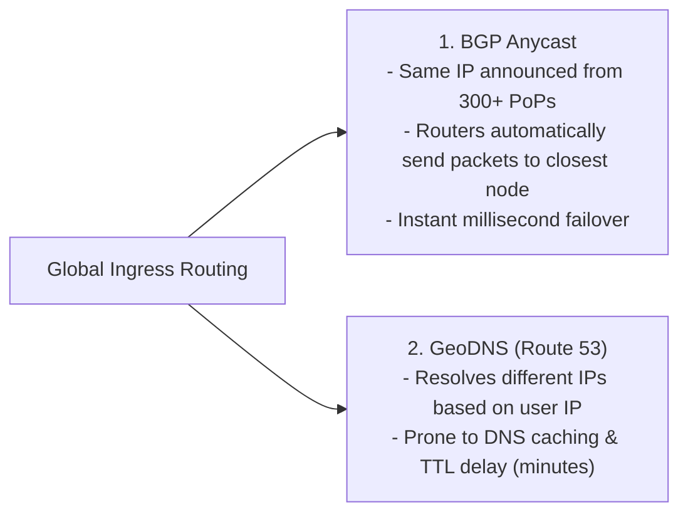

# 13 — Multi-Region & Global-Scale Architecture

## 🌍 1. Multi-Region Topologies: Active-Passive vs Active-Active

Deploying across multiple geographic regions is mandatory for 99.999% availability and low global latency.

```mermaid
flowchart TD
    subgraph ActivePassive["1. Active-Passive (Warm Standby / Disaster Recovery)"]
        AP_DNS["Route 53 Geolocation DNS"] -->|100% Writes & Reads| AP_Primary["Primary Region (US-East)"]
        AP_Primary -.->|Async Cross-Region DB Sync| AP_Standby["Standby Region (EU-West)"]
        AP_Primary -.->|Heartbeat Health Check Fails| AP_Failover["Automated DNS Switch & Promote DB (RTO < 5m)"]
    end

    subgraph ActiveActive["2. Active-Active (Multi-Region Masterless)"]
        AA_Anycast["BGP Anycast Edge"] -->|EU Users| AA_EU["EU-Central Datacenter (100% Active)"]
        AA_Anycast -->|US Users| AA_US["US-East Datacenter (100% Active)"]
        AA_EU <-->|Bidirectional Async Replication + Conflict Resolution (CRDTs)| AA_US
    end
```

| Topology | Write Latency | Read Latency | Consistency | Cost & Operational Complexity |
|---|---|---|---|---|
| **Single Region** | 🚀 Fast local ($< 5\text{ms}$) | Slow for overseas users ($150\text{ms}$) | Strict ACID | 🟢 Lowest cost |
| **Active-Passive (Global Read Replicas)** | 🚀 Fast local | 🚀 Fast regional reads | Eventual consistency on reads | 🟡 Moderate cost |
| **Active-Active (Multi-Region Writes)** | 🚀 Fast local writes | 🚀 Fast local reads | Eventual / CRDT / TrueTime | 🔴 Highest cost & engineering complexity |

---

## ⚡ 2. Global Traffic Routing: Anycast vs GeoDNS



---

## 🔄 3. Cross-Region Conflict Resolution: CRDTs & Last-Write-Wins

When two users concurrently modify data in US and Europe before cross-region replication syncs:

1. **Last-Write-Wins (LWW)**: Relies on physical timestamps (risk of silent data loss on NTP clock drift).
2. **Conflict-Free Replicated Data Types (CRDTs)**:
   - Commutative and associative mathematical structures (e.g. PN-Counters, Observed-Removed Sets) where operations can be applied in any order across regions and still converge to the identical state without locks!
