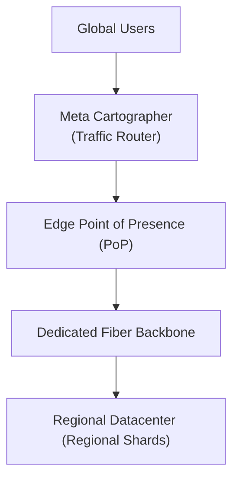

# Case Study: Meta's Global Traffic Routing (Cartographer) & CockroachDB Multi-Region

## 🏢 Context: Delivering Sub-50ms Experiences to 3 Billion Global Users

Meta operates hyperscale data centers across North America, Europe, and Asia. Routing users and synchronizing data across continents without violating data privacy regulations requires automated global traffic management.

---

## 🛠 Engineering Innovations

### 1. Meta's Cartographer: Real-Time Network Mapping
- Rather than static geographic lookups, Meta's **Cartographer** continuously probes client latency, ISP peering congestion, and regional data center capacity.
- Dynamically shifts millions of user connections away from congested routes in real time, reducing global tail latency by 20%.

### 2. Multi-Region CockroachDB & Regional Locality Tables
- **Survival Goals**: Survives an entire regional cloud failure with zero human intervention.
- **Data Locality Primitives**:
  - `REGIONAL TABLES`: Kept strictly in the user's home region for 2ms single-region ACID latency.
  - `GLOBAL TABLES`: Read-heavy reference data (e.g. currency conversion tables) replicated across all continents with sub-millisecond local reads.
