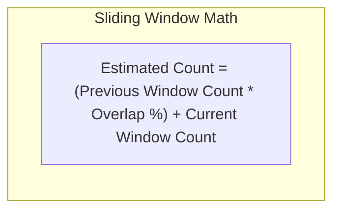

# High-Level Design: Distributed Rate Limiter

## 🏗️ 1. High-Level Architecture

```mermaid
flowchart TD
    Client["Client Traffic (Web / Mobile)"] --> LB["Global Load Balancer"]
    LB --> Gateway["API Gateway / Envoy Reverse Proxy"]

    subgraph RateLimiterMiddleware["Rate Limiter Middleware"]
        RL_Engine["Rate Limiting Filter"]
        LocalCache["Local In-Memory Cache (Caffeine - Hot Rules)"]
    end

    Gateway --> RL_Engine
    RL_Engine <--> LocalCache

    subgraph CentralizedRateLimitTier["Redis Rate Limiter Cluster"]
        RedisCluster["Redis Cluster (Sliding Window Lua Script)"]
        ConfigDB["Rate Limit Rules DB (PostgreSQL)"]
    end

    RL_Engine <-->|Atomic Lua Script (<1ms)| RedisCluster
    LocalCache -.->|Poll Rules Config| ConfigDB

    RL_Engine -->|Quota OK (HTTP 200)| BackendServices["Backend Microservices Cluster"]
    RL_Engine -->|Quota Exceeded| 429Response["HTTP 429 Too Many Requests"]
```

---

## 🧮 2. The Sliding Window Counter Algorithm (Redis Lua Script)

To prevent race conditions without expensive distributed locks, Redis executes the entire sliding window calculation **atomically inside an in-memory Lua script**:



### Atomic Redis Lua Implementation:
```lua
-- KEYS[1]: Rate limit key (e.g. "rl:user_99")
-- ARGV[1]: Current Unix Timestamp (milliseconds)
-- ARGV[2]: Window size in ms (e.g. 60000)
-- ARGV[3]: Max Limit (e.g. 100)

local key = KEYS[1]
local now = tonumber(ARGV[1])
local window = tonumber(ARGV[2])
local limit = tonumber(ARGV[3])

local clear_before = now - window

-- Remove timestamps older than the sliding window
redis.call('ZREMRANGEBYSCORE', key, '-inf', clear_before)

-- Count current requests in window
local current_requests = redis.call('ZCARD', key)

if current_requests < limit then
    -- Add current request timestamp
    redis.call('ZADD', key, now, now)
    redis.call('PEXPIRE', key, window)
    return 1 -- ALLOWED
else
    return 0 -- THROTTLED (HTTP 429)
end
```
