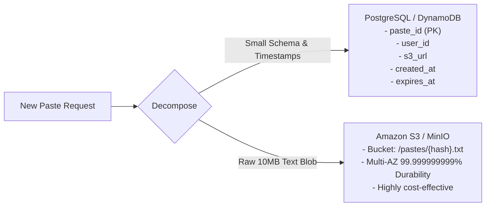

# High-Level Design: Pastebin / Gist

## 🏗️ 1. High-Level Architecture

```mermaid
flowchart TD
    Client["Client Web / CLI"] --> CDN["Cloudflare Edge CDN"]
    CDN --> LB["L7 Load Balancer"]
    LB --> Gateway["API Gateway"]

    subgraph Services["Application Tier"]
        PasteWriteSvc["Paste Creation Service"]
        PasteReadSvc["Paste Retrieval Service"]
        KGS["Key Generation Service (KGS)"]
    end

    Gateway -->|POST /api/v1/pastes| PasteWriteSvc
    Gateway -->|GET /api/v1/pastes/{id}| PasteReadSvc
    PasteWriteSvc <--> KGS

    subgraph StorageLayer["Data & Object Storage Tier"]
        MetadataDB["Metadata Store (PostgreSQL / DynamoDB)"]
        RedisCache["Redis Cache Tier (Hot Pastes)"]
        ObjectStore["Object Storage (Amazon S3 / MinIO - Raw Text Blobs)"]
        CleanupJob["Background TTL Cleanup Worker"]
    end

    PasteReadSvc --> RedisCache
    PasteReadSvc -->|Cache Miss| MetadataDB
    PasteReadSvc -->|Fetch Raw Blob| ObjectStore

    PasteWriteSvc --> MetadataDB
    PasteWriteSvc --> ObjectStore
    PasteWriteSvc --> RedisCache

    CleanupJob --> MetadataDB
    CleanupJob --> ObjectStore
```

---

## 🗄️ 2. Separation of Concerns: Metadata DB vs Object Storage

Storing large variable-length text blobs directly inside PostgreSQL/MySQL tables causes heavy page fragmentation and slows down index scans.



---

## 🌐 3. API Design

### Create Paste
```http
POST /api/v1/pastes
Content-Type: application/json

{
  "content": "function example() { return 'Hello World'; }",
  "title": "sample-code.js",
  "expire_in_seconds": 86400,
  "is_private": false
}

Response: 201 Created
{
  "paste_id": "k8X2pQ",
  "url": "https://pastebin.com/k8X2pQ",
  "expires_at": "2026-08-28T18:00:00Z"
}
```

### Read Paste
```http
GET /api/v1/pastes/{paste_id}

Response: 200 OK
{
  "paste_id": "k8X2pQ",
  "title": "sample-code.js",
  "content": "function example() { return 'Hello World'; }",
  "created_at": "2026-08-27T18:00:00Z"
}
```
