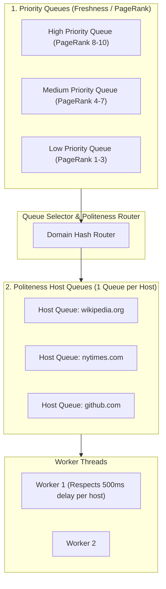

# High-Level Design: Distributed Web Crawler

## 🏗️ 1. High-Level Architecture

```mermaid
flowchart TD
    Seeds["Seed URLs"] --> Frontier["URL Frontier (Priority & Politeness Queues)"]
    
    Frontier --> FetcherWorker["Fetcher Workers (Multi-threaded / Async)"]
    
    subgraph FetcherSubsystem["Fetcher Subsystem"]
        DNSCache["Local DNS Cache"]
        RobotsCache["Robots.txt Cache (Redis)"]
        FetcherWorker <--> DNSCache
        FetcherWorker <--> RobotsCache
    end

    FetcherWorker -->|HTTP GET Page| WebInternet["Target Web Servers"]
    WebInternet -->|HTML Content| FetcherWorker
    
    FetcherWorker --> HTMLParser["HTML Parser & Content Extractor"]
    HTMLParser --> ContentSeen{"Content Duplicate Check?<br/>(SimHash / MD5)"}
    
    ContentSeen -->|New Content| DocStore["Document Store (Amazon S3 / BigTable)"]
    DocStore --> SearchIndexer["Search Engine / Vector Indexer"]

    HTMLParser --> LinkExtractor["Outbound Link Extractor"]
    LinkExtractor --> URLFilter["URL Filter & Normalizer"]
    URLFilter --> URLSeen{"URL Already Visited?<br/>(Bloom Filter)"}

    URLSeen -->|No (New URL)| Frontier
    URLSeen -->|Yes (Already Crawled)| Drop["Discard URL"]
```

---

## 🚦 2. The URL Frontier: Politeness & Freshness

A naive FIFO queue causes two catastrophic failures:
1. **DDoS Attack on Hosts**: Sending 100 concurrent requests to a single small blog server crashes the website.
2. **Starvation**: Spends all time crawling low-quality subpages of one domain while ignoring high-value news homepages.



---

## 🔍 3. Deduplication: Bloom Filter & SimHash

- **URL Deduplication (Bloom Filter)**: Avoids crawling the same URL string twice.
- **Content Deduplication (SimHash)**: Prevents storing near-identical pages (e.g. mirror sites, pages with only footer copyright year changes) using a 64-bit fingerprint and Hamming Distance $\le 3$.
