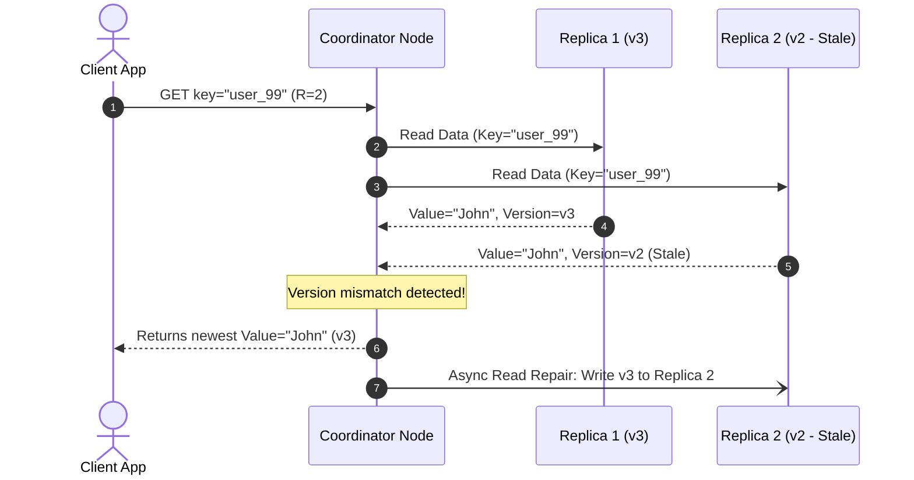

# High-Level Design: Distributed Key-Value Store (Dynamo-Style)

## 🏗️ 1. High-Level Architecture & Ring Topology

```mermaid
flowchart TD
    Client["Client Application"] --> CoordNode["Coordinator Node (Any Node in Ring)"]
    
    subgraph HashRing["Consistent Hash Ring (Token Range 0 to 2^32-1)"]
        N1["Node A (Tokens: 100, 1500)"]
        N2["Node B (Tokens: 400, 3200)"]
        N3["Node C (Tokens: 800, 4800)"]
        N4["Node D (Tokens: 1200, 6000)"]

        N1 <-->|Gossip Protocol (Failure Detection)| N2
        N2 <-->|Gossip Protocol| N3
        N3 <-->|Gossip Protocol| N4
        N4 <-->|Gossip Protocol| N1
    end

    CoordNode -->|Quorum Write W=2| N1
    CoordNode -->|Quorum Write W=2| N2
    CoordNode -.->|Async Write| N3
```

---

## ⚙️ 2. Core Distributed Mechanics

### 1. Consistent Hashing with Virtual Nodes
- Partitions key-space across 128 virtual nodes per physical host.

### 2. Node Storage Engine: LSM-Tree
- Each storage node runs an embedded LSM-Tree engine (e.g. **RocksDB**):
  - In-memory Memtable (Fast write)
  - Write-Ahead Log (WAL on SSD for durability)
  - Immutable SSTables on disk with Bloom Filters for $O(1)$ existence checks.

### 3. Failure Detection: Gossip Protocol
- Nodes periodically ping randomized neighbor nodes every second with heartbeat counter vectors.
- If a node's heartbeat stops incrementing for $> 10$ seconds, the cluster marks it suspect and initiates **Hinted Handoff**.

---

## 🗳️ 3. Quorum Reads & Read Repair


