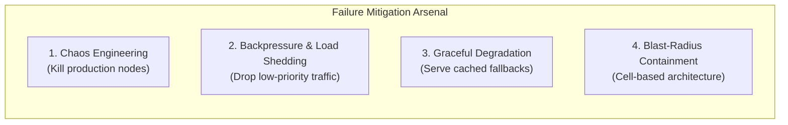
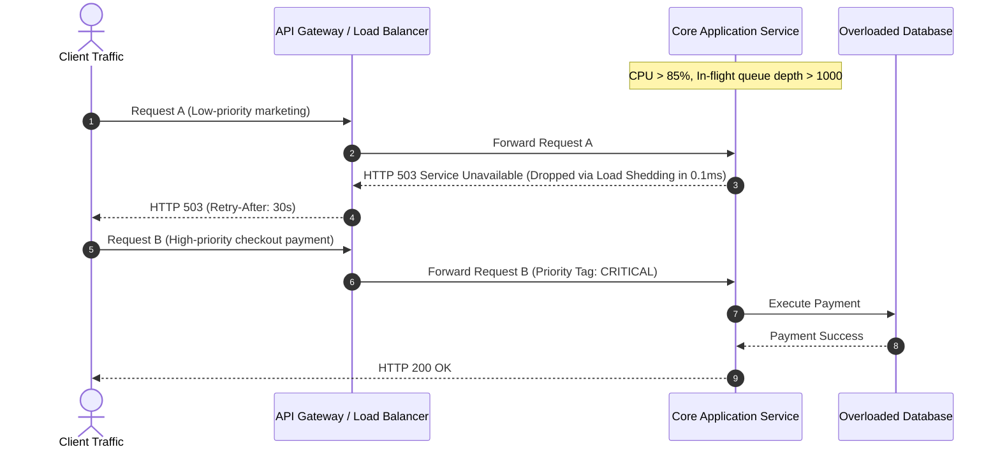

# 14 — Operational Excellence & Failure Engineering

## 💥 1. The Reality of Distributed Failures

In hyperscale distributed systems, **hardware failure is not an anomaly; it is a statistical certainty every single hour**.

---

## 🌊 2. Backpressure & Load Shedding Algorithms

When downstream services (e.g. database or payment gateway) slow down, incoming requests queue up until thread pools exhaust and servers crash.

### Load Shedding Strategies:
1. **Priority Buckets**: Separate traffic into `CRITICAL` (checkout), `STANDARD` (browse), and `BACKGROUND` (analytics/crawlers). Drop background first.
2. **CoDel (Controlled Delay)**: Measure time requests spend waiting in queue before processing starts. If queue wait time exceeds 20ms, drop requests immediately without executing business logic.

---

## 🧪 3. Chaos Engineering Principles

- **Steady State Hypothesis**: Define normal metrics (e.g. 99.9% success rate, p99 latency < 100ms).
- **Vary Real-World Events**: Inject random network packet loss (10%), CPU spikes (100%), killed master database nodes, and severed cross-region links.
- **Automate Continuous Chaos**: Run chaos simulations automatically in production during working hours so on-call engineers are present.
