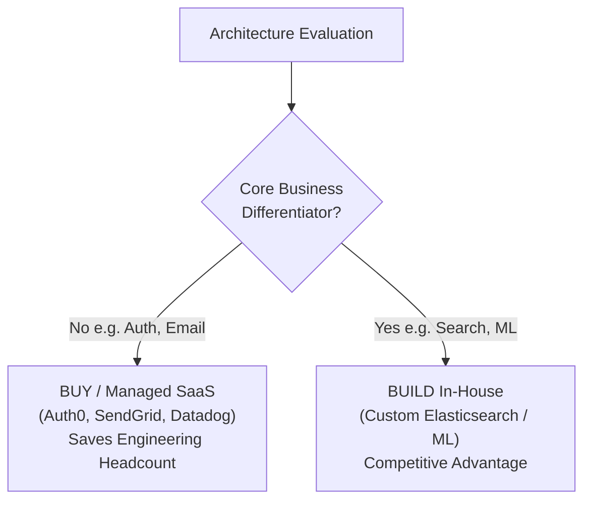

# 15 — Cost, Build-vs-Buy & Technical Strategy

## 💰 1. Total Cost of Ownership (TCO) Analysis

A Staff/Principal Engineer evaluates not just "will it scale", but **"what is the Total Cost of Ownership over a 3-year horizon?"**

$$\text{TCO} = \text{Infrastructure Cloud Bills} + \text{Third-Party SaaS Licensing} + \text{Engineering Headcount Maintenance Cost}$$



---

## 🌳 2. Zero-Downtime Migration: The Strangler Fig Pattern

How do you migrate a 10-year-old monolithic database or legacy API to a new modern microservice without stopping production or taking scheduled downtime?

```mermaid
flowchart TD
    Client["Client Traffic"] --> EdgeProxy["Strangler Fig Router / API Gateway"]
    
    subgraph LegacyMonolith["Legacy Monolith (Deprecated)"]
        Monolith["Monolithic Application & Database"]
    end

    subgraph ModernService["Modern Architecture (Target)"]
        Microservice["New Microservice"]
        NewDB[("New Partitioned Database")]
    end

    EdgeProxy -->|90% Unmigrated Routes| Monolith
    EdgeProxy -->|10% Migrated Route: /v2/checkout| Microservice
    Microservice --> NewDB
    Monolith -.->|CDC Sync (Debezium WAL)| NewDB
```

### The 4 Phases of Safe Migration:
1. **Intercept**: Deploy an edge proxy (Strangler Fig) in front of the legacy monolith.
2. **Dual-Writing & Shadow Traffic (Dark Launching)**: Write data to both old and new databases simultaneously; asynchronously compare results in worker threads without returning new responses to users.
3. **Cut Over (Traffic Shifting)**: Gradually route 1% $\rightarrow$ 10% $\rightarrow$ 50% $\rightarrow$ 100% of read traffic to the new service using feature flags.
4. **Decommission**: Deprecate legacy monolith code paths and purge old database tables.
