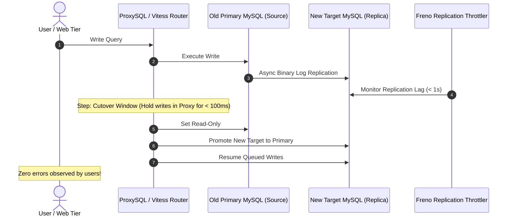

# Case Study: GitHub's Zero-Downtime MySQL Database Migration & Shopify's Modular Monolith

## 🏢 Context: Migrating Petabytes of Critical Data with Zero User Downtime

GitHub hosts hundreds of millions of repositories. Migrating their primary MySQL clusters across major database versions and data centers required zero read/write downtime.

---

## 🛠 Engineering Decisions & Takeaways

### 1. GitHub's `gh-ost` and Freno
- Standard `ALTER TABLE` locks giant tables for hours.
- GitHub built **`gh-ost`** (GitHub Online Schema Migrations) to apply migrations row-by-row in the background, pausing automatically if replication lag spikes via **Freno**.

### 2. Shopify's Modular Monolith vs Microservices
- Shopify deliberately rejected decomposing into hundreds of microservices.
- Instead, Shopify engineered a **Modular Monolith** using strict Ruby package encapsulation (`Packwerk`), saving tens of millions in cloud infrastructure costs and avoiding cross-service network latency.
