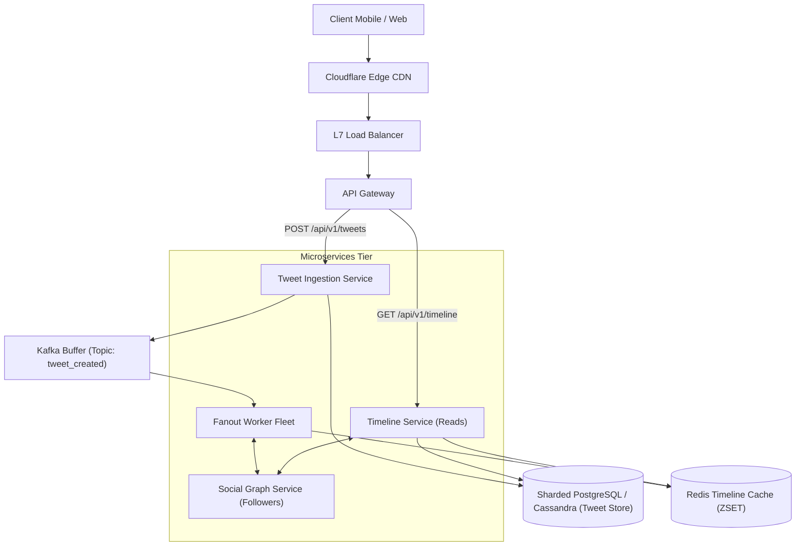

# High-Level Design: Twitter / News Feed System

## 🏗️ 1. High-Level Architecture



---

## ⚡ 2. Fan-out on Write vs Fan-out on Read: The Hybrid Model

```mermaid
flowchart TD
    Tweet["User Posts Tweet"] --> Check{"Is Author a Celebrity?<br/>(> 50k Followers)"}
    
    Check -->|No (Standard User)| Push["Fan-out on Write (Push Model)<br/>- Fanout worker fetches all followers<br/>- Injects Tweet ID directly into followers' Redis ZSET<br/>- Result: Home feed loads in < 5ms"]
    
    Check -->|Yes (Celebrity User)| Pull["Fan-out on Read (Pull Model)<br/>- Do NOT push to 50M followers<br/>- When follower loads feed, merge celebrity tweets dynamically"]
```

---

## 🗄️ 3. Data Model

### Tweets Table (Cassandra / PostgreSQL)
```sql
CREATE TABLE tweets (
    tweet_id BIGINT PRIMARY KEY, -- 64-bit Twitter Snowflake ID
    user_id BIGINT NOT NULL,
    content VARCHAR(280) NOT NULL,
    media_url VARCHAR(512),
    created_at TIMESTAMP WITH TIME ZONE NOT NULL,
    INDEX idx_user_created (user_id, created_at DESC)
);
```

### Followers Table (Graph / PostgreSQL)
```sql
CREATE TABLE follows (
    follower_id BIGINT NOT NULL,
    followee_id BIGINT NOT NULL,
    created_at TIMESTAMP DEFAULT CURRENT_TIMESTAMP,
    PRIMARY KEY (follower_id, followee_id),
    INDEX idx_followee (followee_id)
);
```
