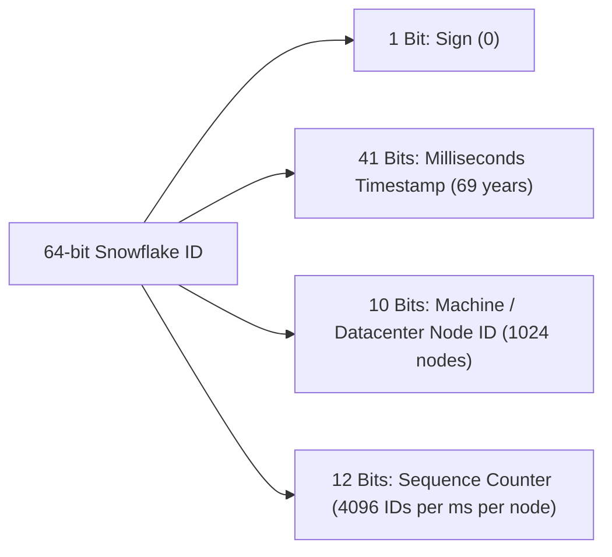

# Trade-offs & Deep Dive: Twitter / News Feed System

## ⚖️ 1. Push vs Pull vs Hybrid Feed Generation

| Model | Pros | Cons | Decision |
|---|---|---|---|
| **Fan-out on Write (Push)** | 🚀 Blazing fast feed reads ($O(1)$ from Redis). | 🔴 Massive write amplification when celebrities tweet. | Great for regular users ($< 50\text{k}$ followers). |
| **Fan-out on Read (Pull)** | 🟢 Write is instant $O(1)$. Zero fanout write spikes. | 🔴 Slow read latency ($O(N)$ SQL multi-user join queries). | Great for celebrity authors. |
| **Hybrid Fan-out Model** | 🟢 Combines instant read latency with zero celebrity spikes. | 🟡 Slightly higher code complexity in Timeline Service. | **Chosen Industry Standard (Twitter / Meta)**. |

---

## ❄️ 2. Distributed Unique ID Generation: Twitter Snowflake

How do we generate 64-bit globally unique, time-ordered IDs without database auto-increment locks?

- Generates up to **4,096,000 unique, globally sortable IDs per millisecond per machine** with zero cross-network coordination!
