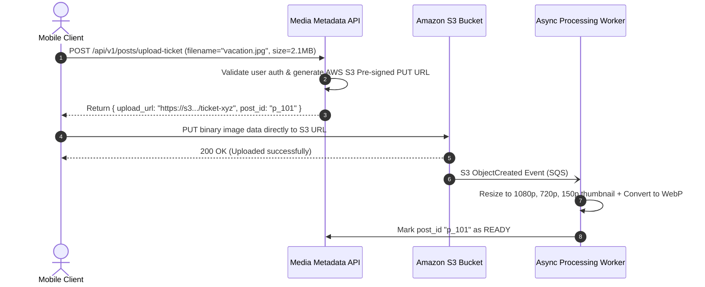

# High-Level Design: Instagram

## 🏗️ 1. High-Level Architecture

```mermaid
flowchart TD
    Client["Client Mobile App (iOS / Android)"] --> EdgeCDN["Global CDN Edge (Cloudflare / Fastly)"]
    
    subgraph UploadFlow["Media Upload Flow (Pre-signed S3)"]
        Client -->|1. Request Upload Token| Gateway["API Gateway"]
        Gateway --> MediaSvc["Media Metadata Service"]
        MediaSvc -->> Client: 200 OK (Pre-signed S3 Upload URL)
        Client -->|2. Direct Binary PUT (2MB)| S3Bucket["Amazon S3 Raw Bucket"]
        S3Bucket -->|S3 Event Notification| TranscoderWorker["Image/Video Processing Worker Fleet"]
        TranscoderWorker -->|Generate Thumbnails & WebP| S3Processed["Processed S3 Bucket"]
        TranscoderWorker --> PostDB[("PostgreSQL / Cassandra (Post Metadata)")]
    end

    subgraph FeedFlow["Feed & Delivery Flow"]
        Client -->|3. Fetch Feed| EdgeCDN
        EdgeCDN -->|Dynamic API| Gateway
        Gateway --> FeedSvc["Feed Generation Service"]
        FeedSvc <--> RedisFeedCache[("Redis Feed Cache")]
        FeedSvc --> PostDB
        EdgeCDN -->|4. Stream Photos/Videos| S3Processed
    end
```

---

## 📸 2. Direct-to-S3 Pre-signed URL Upload Pattern



---

## 🗄️ 3. Data Model

```sql
CREATE TABLE posts (
    post_id BIGINT PRIMARY KEY, -- Snowflake ID
    user_id BIGINT NOT NULL,
    image_url VARCHAR(512) NOT NULL,
    thumbnail_url VARCHAR(512) NOT NULL,
    caption TEXT,
    likes_count INT DEFAULT 0,
    comments_count INT DEFAULT 0,
    created_at TIMESTAMP WITH TIME ZONE DEFAULT CURRENT_TIMESTAMP,
    INDEX idx_user_posts (user_id, created_at DESC)
);
```
