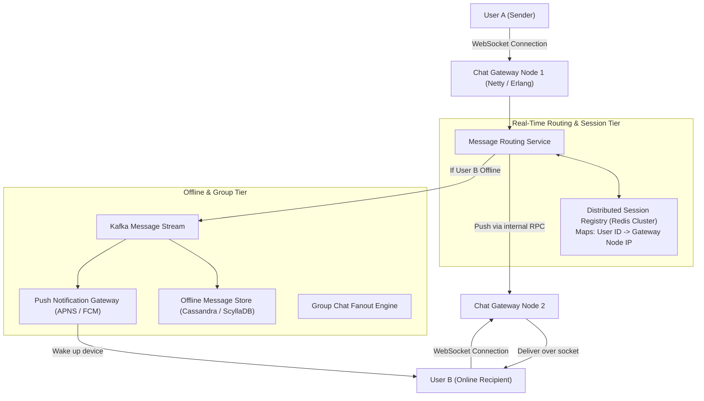
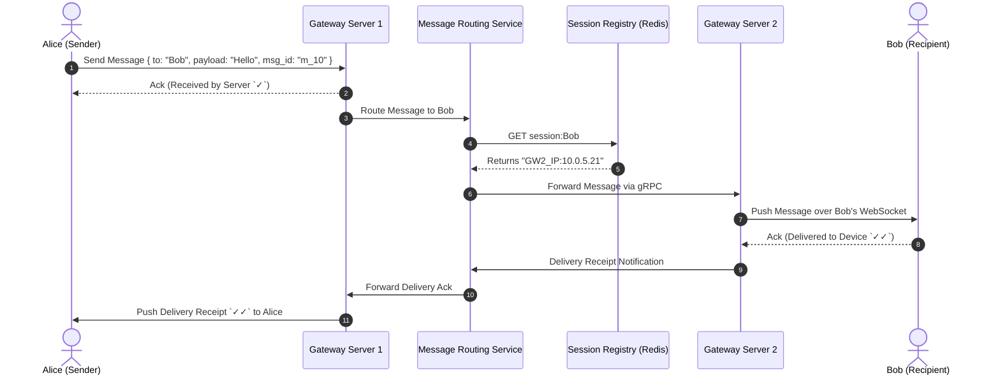

# High-Level Design: WhatsApp / Real-Time Chat System

## 🏗️ 1. High-Level Architecture



---

## ⚡ 2. End-to-End Message Delivery Flow



---

## 🗄️ 3. Data Model (Cassandra Wide-Column Store)

```sql
CREATE TABLE user_messages (
    user_id BIGINT,
    message_id BIGINT, -- Snowflake ID
    sender_id BIGINT,
    conversation_id VARCHAR(64),
    encrypted_content BLOB,
    status VARCHAR(16), -- SENT, DELIVERED, READ
    created_at TIMESTAMP,
    PRIMARY KEY ((user_id), message_id)
) WITH CLUSTERING ORDER BY (message_id DESC);
```
