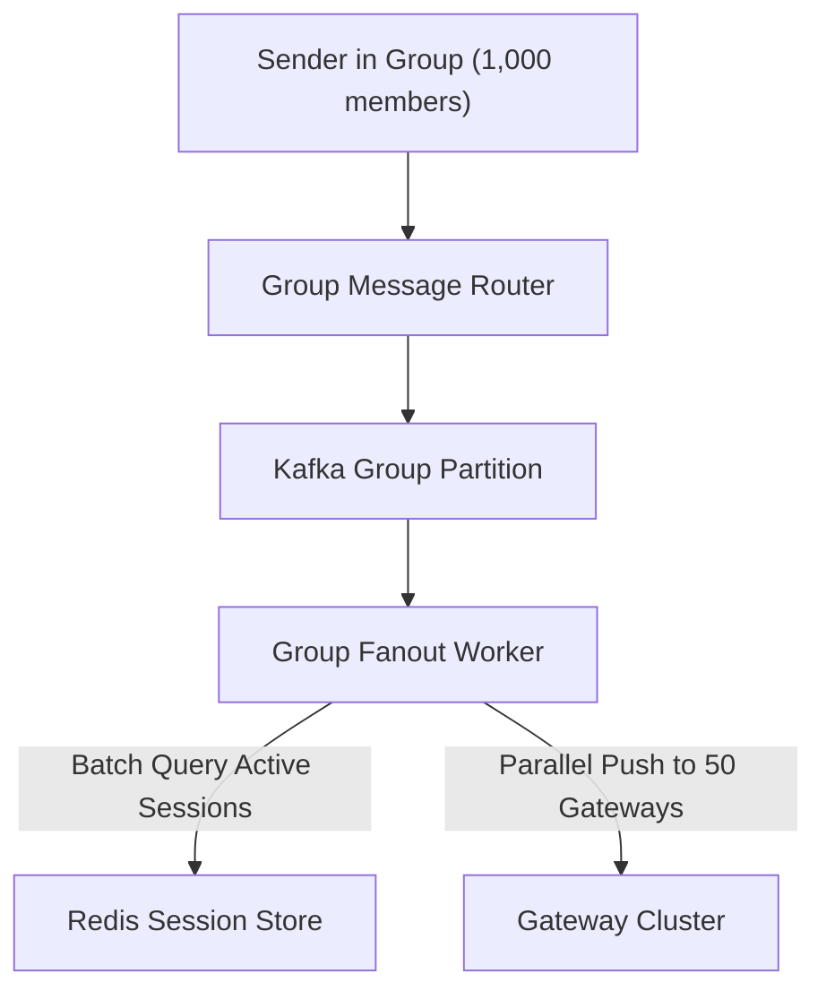

# Trade-offs & Deep Dive: WhatsApp Chat System

## ⚖️ 1. Epoll / Netty Event Loop vs Thread-Per-Connection

| Architecture | 1 Thread per Connection | Event-Driven Async I/O (Epoll / Netty / Erlang) |
|---|---|---|
| **Max Concurrent Conns** | 🔴 Crashes at $\sim 10,000$ threads (Stack memory limit) | 🟢 **1,000,000+ connections per server** |
| **Context Switching** | Severe CPU thrashing | Minimal CPU overhead |
| **Recommendation** | ❌ Deprecated | ✅ **Mandatory for Chat Gateways** |

---

## 👥 2. Scaling Group Chats (1,000 Members)

- **Client-Side vs Server-Side Fanout**:
  - Sending 1,000 individual messages from the sender device drains battery and network bandwidth.
  - **Solution**: The sender uploads **1 message to the server**. The server-side Kafka worker fleet fans out the message to all 1,000 group participants in parallel.
