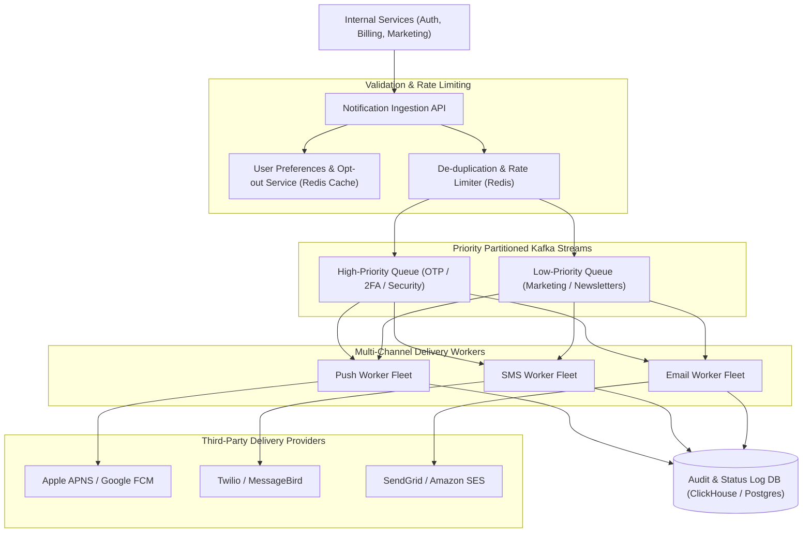
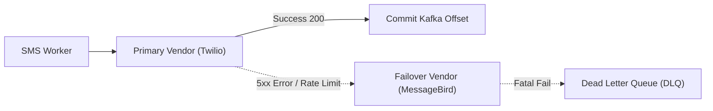

# High-Level Design: Distributed Notification System

## 🏗️ 1. High-Level Architecture

```mermaid
flowchart TD
    InternalSvc["Internal Services (Auth, Billing, Marketing)"] --> Gateway["Notification Ingestion API"]

    subgraph ValidationTier["Validation & Rate Limiting"]
        Gateway --> PrefService["User Preferences & Opt-out Service (Redis Cache)"]
        Gateway --> DedupFilter["De-duplication & Rate Limiter (Redis)"]
    end

    subgraph KafkaPriorities["Priority Partitioned Kafka Streams"]
        DedupFilter --> HighPriority["High-Priority Queue (OTP / 2FA / Security)"]
        DedupFilter --> LowPriority["Low-Priority Queue (Marketing / Newsletters)"]
    end

    subgraph WorkerFleet["Multi-Channel Delivery Workers"]
        HighPriority & LowPriority --> PushWorker["Push Worker Fleet"]
        HighPriority & LowPriority --> SMSWorker["SMS Worker Fleet"]
        HighPriority & LowPriority --> EmailWorker["Email Worker Fleet"]
    end

    subgraph ExternalThirdParty["Third-Party Delivery Providers"]
        PushWorker --> APNS["Apple APNS / Google FCM"]
        SMSWorker --> Twilio["Twilio / MessageBird"]
        EmailWorker --> SendGrid["SendGrid / Amazon SES"]
    end

    PushWorker & SMSWorker & EmailWorker --> AuditDB[("Audit & Status Log DB (ClickHouse / Postgres)")]
```

---

## ⚡ 2. Pluggable Vendor Failover Pattern

```mermaid
flowchart LR
    SMSWorker["SMS Worker"] --> PrimaryVendor["Primary Vendor (Twilio)"]
    PrimaryVendor -->|Success 200| Ack["Commit Kafka Offset"]
    PrimaryVendor -.->|5xx Error / Rate Limit| SecondaryVendor["Failover Vendor (MessageBird)"]
    SecondaryVendor -.->|Fatal Fail| DLQ["Dead Letter Queue (DLQ)"]
```
