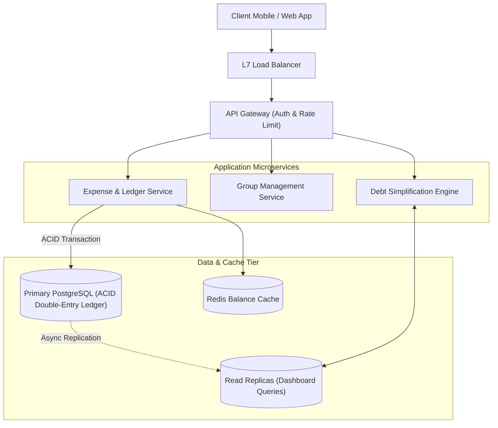
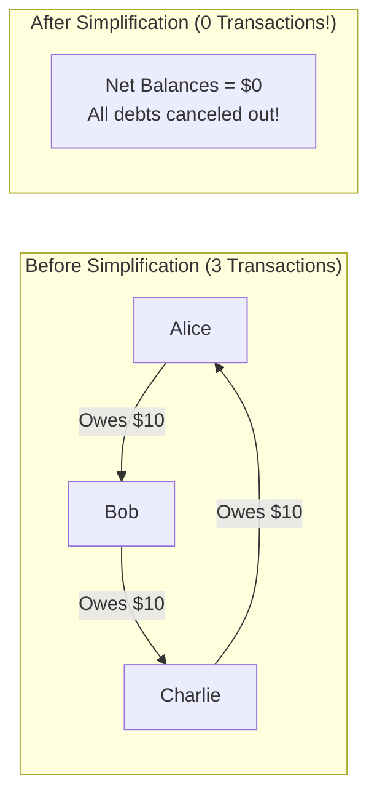

# High-Level Design: Splitwise

## 🏗️ 1. High-Level Architecture



---

## 🧮 2. The Debt Simplification Graph Algorithm

How do we reduce $N$ circular IOUs into the minimum number of cash transactions?



### Algorithm (Greedy Max-Heap / Min-Heap):
1. Compute the **Net Balance** for each person in the group:
   $$\text{Net}(u) = \sum \text{Paid} - \sum \text{Owed}$$
2. Separate users into two priority heaps:
   - **Debtors Heap** (People with negative balance who owe money).
   - **Creditors Heap** (People with positive balance who should receive money).
3. In each step, take the largest debtor and largest creditor, settle the minimum of the two amounts, and update the heaps until all balances reach 0.
4. **Complexity**: Reduces maximum transactions from $O(V^2)$ to at most **$V - 1$ transactions**!

---

## 🗄️ 3. Double-Entry Accounting Schema

```sql
CREATE TABLE expenses (
    expense_id BIGINT PRIMARY KEY,
    group_id BIGINT,
    paid_by_user_id BIGINT NOT NULL,
    total_amount DECIMAL(12, 2) NOT NULL,
    description VARCHAR(255),
    created_at TIMESTAMP WITH TIME ZONE DEFAULT CURRENT_TIMESTAMP
);

CREATE TABLE expense_splits (
    split_id BIGINT PRIMARY KEY,
    expense_id BIGINT REFERENCES expenses(expense_id),
    user_id BIGINT NOT NULL,
    owed_amount DECIMAL(12, 2) NOT NULL
);
```
