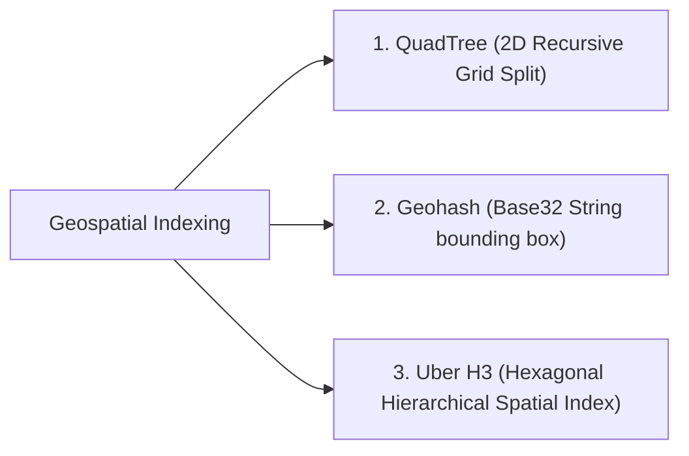
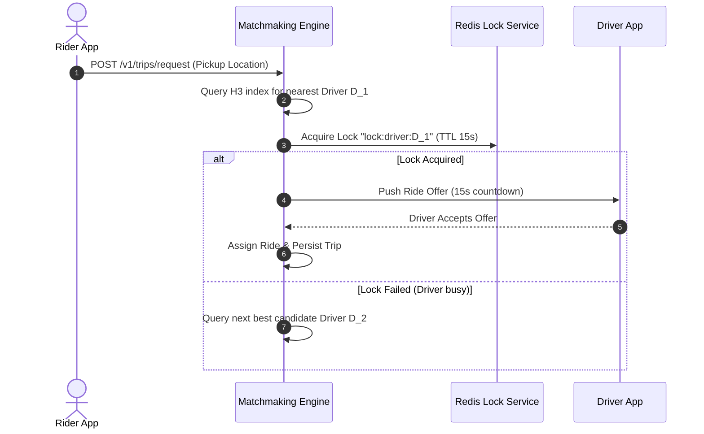

# High-Level Design: Uber / Ride Hailing Matching System

## 🏗️ 1. High-Level Architecture

```mermaid
flowchart TD
    DriverApp["Driver App (Streams GPS every 4s)"] -->|WebSocket / gRPC| LocationGW["Driver Location Gateway Fleet"]
    RiderApp["Rider App (Request Ride)"] -->|HTTPS / WebSocket| MatchGW["Matching API Gateway"]

    subgraph RealTimeLocationTier["Real-Time Location & Geospatial Index"]
        LocationGW --> Kafka["Kafka Location Stream (Partitioned by City)"]
        Kafka --> LocationIngester["Location Ingester Workers"]
        LocationIngester --> GeoCache[("In-Memory Geospatial Index (Redis GEO / Google S2 / H3)")]
    end

    subgraph MatchmakingCore["Matchmaking & Dispatch Engine"]
        MatchGW --> MatchEngine["Matchmaking Engine (Finds nearest 10 drivers)"]
        MatchEngine <--> GeoCache
        MatchEngine --> LockService["Distributed Lock / Fencing (Redis Redlock)"]
        MatchEngine --> Dispatcher["Dispatch Notification Worker"]
    end

    Dispatcher -->|Push Ride Offer| LocationGW
    LocationGW --> DriverApp

    MatchEngine --> TripDB[("Trip Master Database (PostgreSQL / Docstore)")]
```

---

## 🗺️ 2. Geospatial Indexing: QuadTree vs Geohash vs Google S2 / Uber H3

### Why Uber Uses Hexagons (H3):
- **Equidistant Neighbors**: In a square grid, diagonal neighbors are $\sqrt{2}\times$ further away than orthogonal neighbors. In a **Hexagon (H3)**, all 6 neighboring cells are at the exact same distance, making circular radius searches mathematically clean and invariant to orientation!

---

## 🔒 3. Preventing Double Dispatch with Distributed Locks

