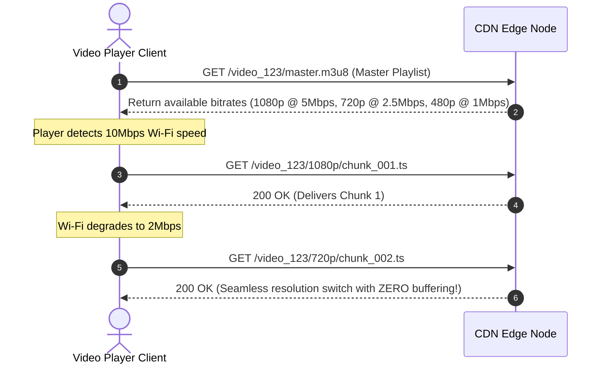

# High-Level Design: YouTube / Netflix Video Streaming

## 🏗️ 1. High-Level Architecture

```mermaid
flowchart TD
    subgraph IngestionPipeline["1. Video Ingestion & Transcoding Pipeline"]
        Creator["Video Creator"] -->|Direct Multi-part Upload| RawS3["Raw Video S3 Storage"]
        RawS3 -->|Trigger Event| IngestQueue["Kafka / SQS Transcode Queue"]
        IngestQueue --> TranscoderCluster["Distributed Transcoder Fleet (GPU / FFMPEG)"]
        
        TranscoderCluster --> Chunking["Video Chunking (2 to 6 sec .ts / .m4s slices)"]
        Chunking --> ManifestGen["Generate Manifest Playlist (.m3u8 / .mpd)"]
        ManifestGen --> ProcessedS3["Processed Chunks S3 Storage"]
    end

    subgraph PlaybackPipeline["2. Global Video Delivery & Edge Streaming"]
        Viewer["End-User Video Player"] --> EdgeCDN["ISP Edge CDN (Netflix Open Connect / Cloudflare)"]
        EdgeCDN -->|Fetch Manifest| ProcessedS3
        Viewer -->|Adaptive Bitrate Query (HLS / MPEG-DASH)| EdgeCDN
    end
```

---

## 🎬 2. Adaptive Bitrate Streaming (ABR: HLS vs MPEG-DASH)



---

## 🗄️ 3. Data Model

```sql
CREATE TABLE video_metadata (
    video_id VARCHAR(16) PRIMARY KEY,
    uploader_id BIGINT NOT NULL,
    title VARCHAR(255) NOT NULL,
    description TEXT,
    master_playlist_url VARCHAR(512) NOT NULL,
    duration_seconds INT NOT NULL,
    status VARCHAR(16), -- PROCESSING, READY, FAILED
    views_count BIGINT DEFAULT 0,
    created_at TIMESTAMP WITH TIME ZONE DEFAULT CURRENT_TIMESTAMP
);
```
