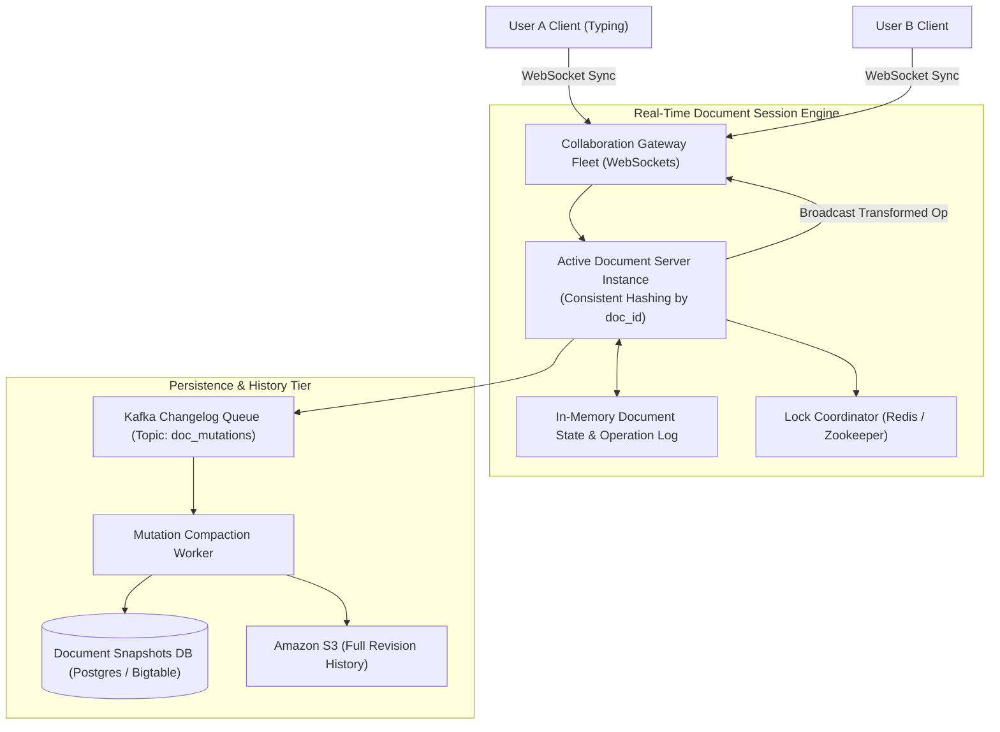
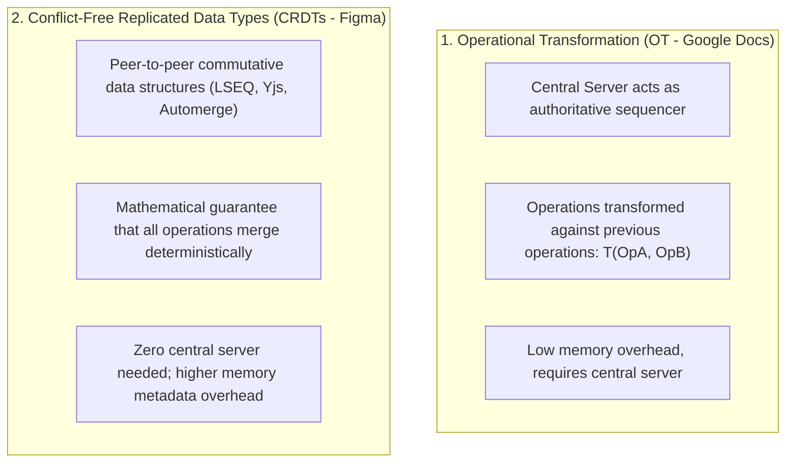

# High-Level Design: Google Docs Collaborative Editor

## 🏗️ 1. High-Level Architecture

---

## 🔀 2. Conflict Resolution: Operational Transformation (OT) vs CRDTs

When User A and User B concurrently insert characters at position 3, a standard write overwrite causes text corruption.

### Operational Transformation (OT) in Action:
- Original Text: `"CAT"`
- User A inserts `'H'` at index 0 $\rightarrow$ `OpA = Insert('H', 0)` $\rightarrow$ `"HCAT"`
- User B inserts `'S'` at index 3 $\rightarrow$ `OpB = Insert('S', 3)` $\rightarrow$ `"CATS"`
- **OT Transformation**:
  - The server transforms `OpB` against `OpA`: since `OpA` shifted text by 1 index, `OpB'` becomes `Insert('S', 4)`.
  - Both screens converge to: **`"HCATS"`**!
