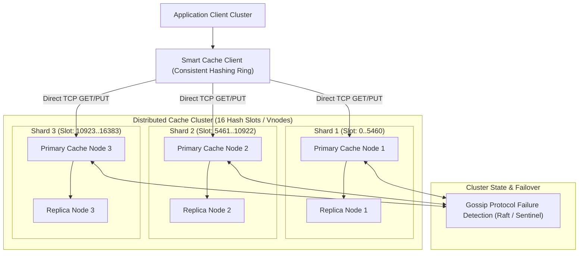
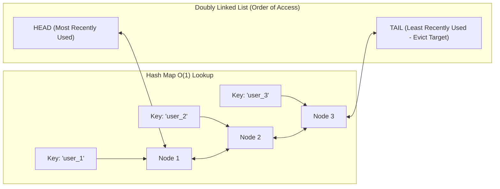

# High-Level Design: Distributed Cache System

## 🏗️ 1. High-Level Architecture

---

## 🧮 2. LRU Eviction: Doubly Linked List + Hash Map

To guarantee $O(1)$ time complexity for both `get()` and `put()` operations:

- **`get(key)`**: Look up node in Hash Map $O(1)$. Move node to `HEAD` of Doubly Linked List $O(1)$.
- **`put(key, value)`**: If key exists, update value and move to `HEAD`. If new, insert at `HEAD`. If memory full, delete node at `TAIL` from both Doubly Linked List and Hash Map $O(1)$.

---

## ⏰ 3. TTL Expiration Strategies

1. **Passive / Lazy Expiration**: When a client calls `get(key)`, the server checks if `current_time > expiry_time`. If expired, it deletes the key and returns `nil`.
2. **Active Periodic Expiration**: A background timer runs 10 times per second, testing 20 random keys with TTLs. If $> 25\%$ are expired, it repeats the cycle to prevent stale memory leaks.
