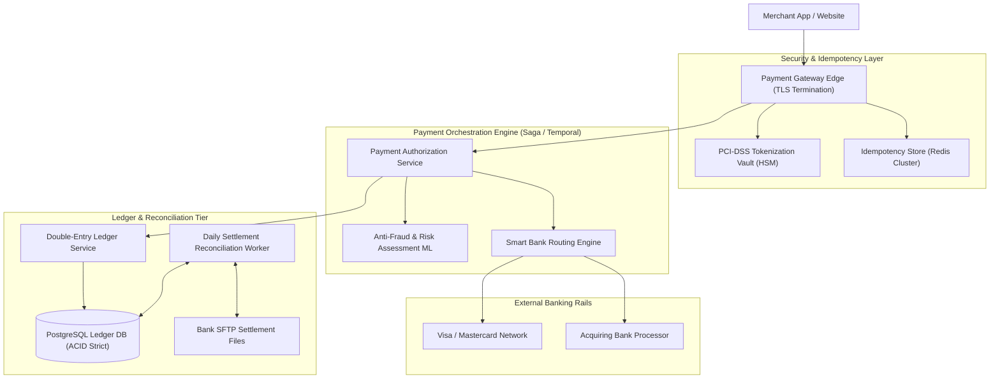
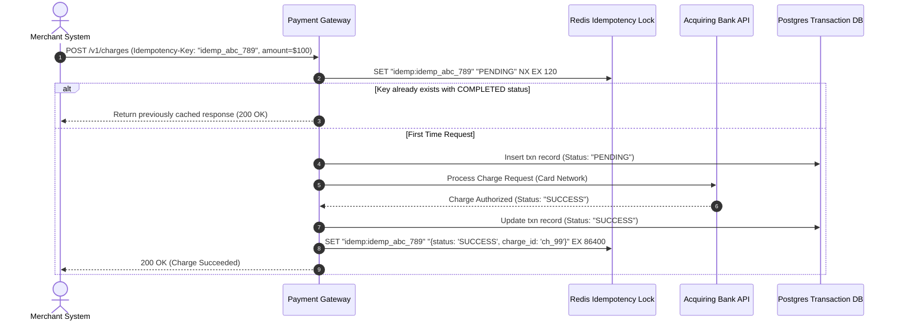
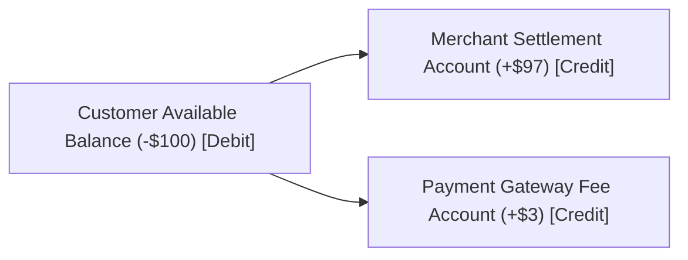

# High-Level Design: Payment Gateway System

## 🏗️ 1. High-Level Architecture



---

## 🔒 2. Distributed Idempotency State Machine



---

## 🏛️ 3. Double-Entry Accounting Ledger

In financial accounting, money is never created or destroyed out of thin air; every debit has a matching credit ($\sum \text{Debits} = \sum \text{Credits}$):



```sql
CREATE TABLE ledger_entries (
    entry_id BIGINT PRIMARY KEY,
    transaction_id BIGINT NOT NULL,
    account_id BIGINT NOT NULL,
    amount DECIMAL(18, 4) NOT NULL, -- Positive for Credit, Negative for Debit
    currency VARCHAR(3) NOT NULL,
    created_at TIMESTAMP WITH TIME ZONE DEFAULT CURRENT_TIMESTAMP,
    INDEX idx_txn (transaction_id),
    INDEX idx_account (account_id)
);
```
