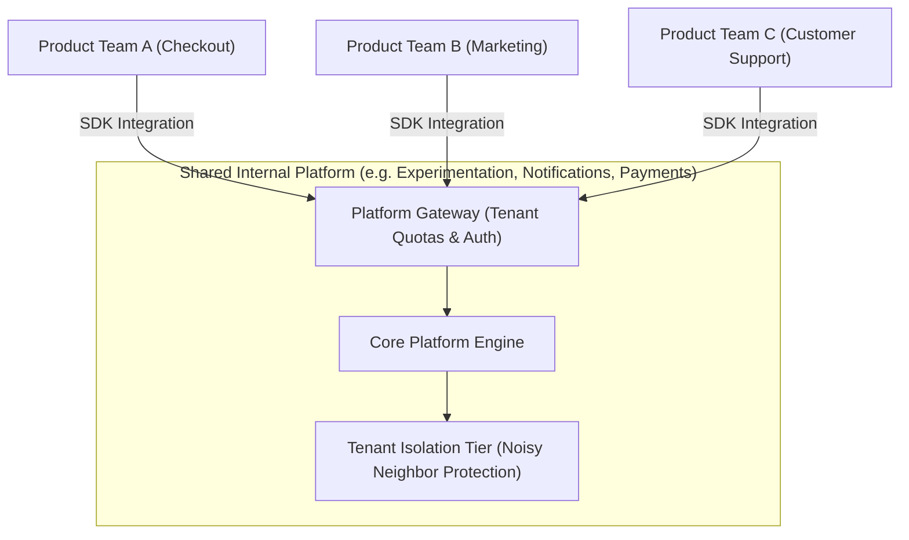
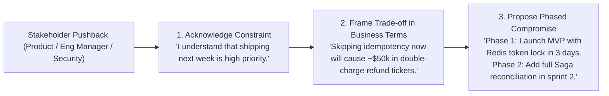

# 16 — Org-Level Platform Thinking & Engineering Communication

## 🏢 1. Platform Engineering: Building Multi-Tenant Shared Infrastructure

A Staff/Principal Engineer builds systems consumed not just by end-users, but by **dozens of internal product engineering teams**.

---

## 📄 2. The Anatomy of a World-Class RFC / Architecture Design Document

At top tech firms (Google, Amazon, Meta, Stripe), major architectural decisions require an **RFC (Request for Comments)** or **Design Document** before writing code:

### Standard Staff RFC Template:
1. **Title, Author, Reviewers, Status** (`PROPOSED`, `ACCEPTED`, `SUPERSEDED`).
2. **Context & Problem Statement**: What is broken, and why is existing architecture failing?
3. **Goals & Non-Goals**: Explicitly declare what is in scope vs out of scope.
4. **Proposed Architecture**: Detailed diagrams, API schemas, data models, and data flows.
5. **Alternative Architectures Considered**: 2–3 alternative designs and the exact reasons they were rejected.
6. **Cross-Cutting Concerns**: Security, Compliance (GDPR), Observability, Rollout/Rollback plan.
7. **Total Cost of Ownership (TCO)**: Estimated cloud and operational cost.

---

## 🛡️ 3. Defending Technical Trade-offs Under Pushback

