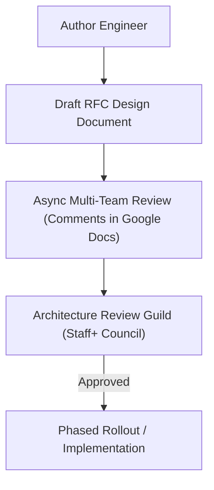

# Case Study: Stripe's API Design Review Culture & Airbnb's RFC Process

## 🏢 Context: Maintaining Cohesive Architecture Across 5,000+ Engineers

As technology companies scale from 50 to 5,000 engineers, architectural quality and API consistency rapidly degrade without structured governance.

---

## 🛠 Engineering Governance Innovations

### 1. Stripe's API Review Council
- Stripe treats API endpoints as public products that can **never have breaking changes for 10+ years**.
- Every proposed API field, endpoint name, and error code must be approved by a specialized **API Review Guild**, ensuring absolute consistency across thousands of developer endpoints.

### 2. Airbnb's RFC Lifecycle
- All non-trivial technical projects require an RFC.
- RFCs explicitly mandate an **"Alternatives Considered"** section. An RFC that does not analyze at least two rejected alternatives is automatically rejected for lack of architectural rigor.
