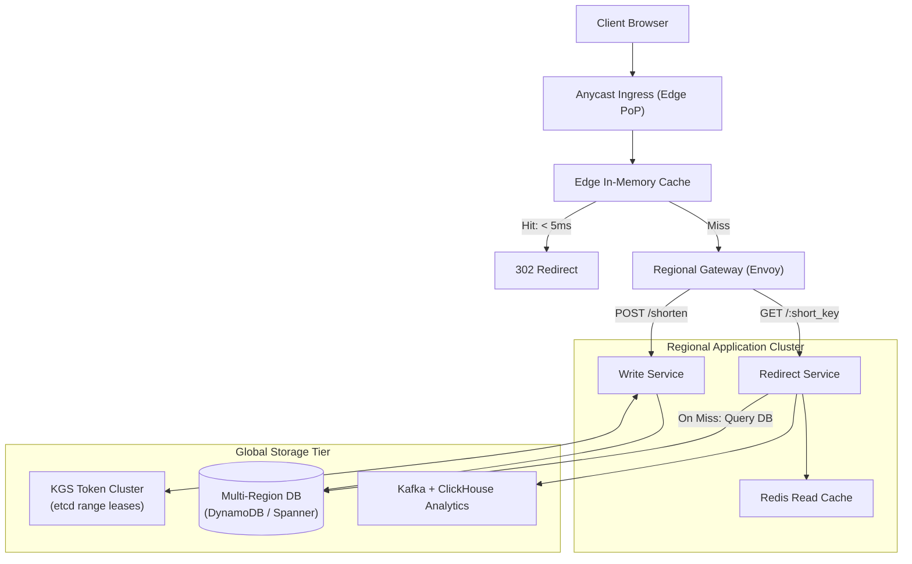

# High-Level Design: URL Shortener @ 1B Users

## 🏗️ 1. Global Multi-Region Architecture

---

## 🔑 2. Multi-Region Key Generation Service (KGS)

- To prevent multi-region token conflicts, KGS nodes are assigned **non-overlapping token ranges** via ZooKeeper/etcd (e.g. Node 1 gets tokens $1\dots 10^7$, Node 2 gets $10^7+1\dots 2\times 10^7$).
- Nodes dispense Base62 tokens in $O(1)$ RAM without distributed network locking!
