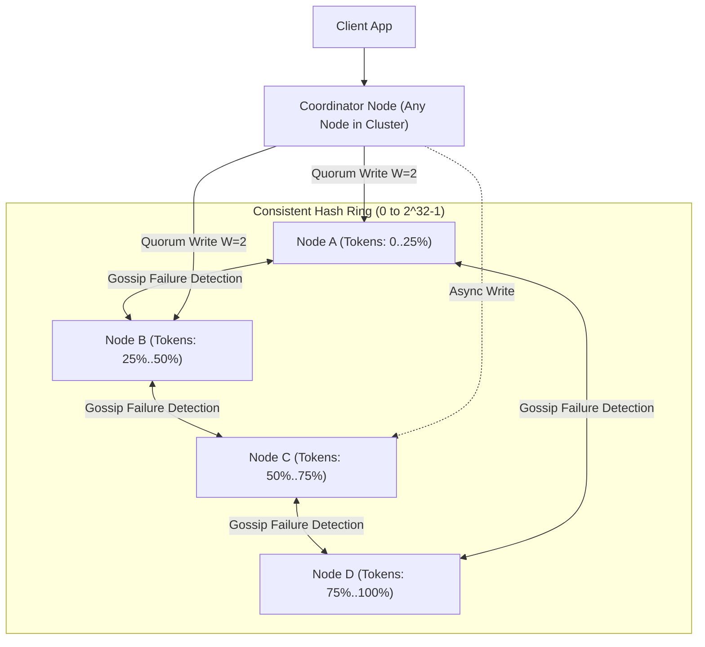

# High-Level Design: Distributed Key-Value Store

## 🏗️ 1. Masterless Ring Architecture

---

## ⚙️ 2. Storage Node Internals: LSM-Tree & SSTables
- **Write Path**: Appends to Commit Log (WAL) on disk + In-memory Memtable (RAM) $\rightarrow$ Returns 200 OK in $< 1\text{ms}$.
- **Flush & Compaction**: Memtable flushes to immutable SSTable files on disk; background compactions merge duplicates.
- **Read Path**: Checks Memtable $\rightarrow$ Bloom Filter $\rightarrow$ SSTables on disk.
