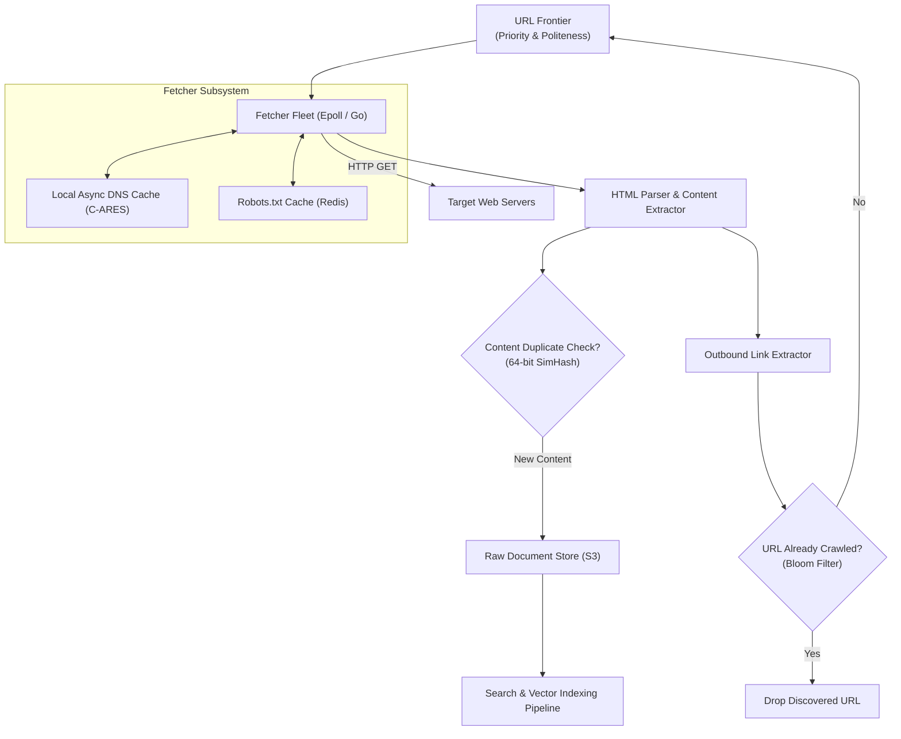

# High-Level Design: Distributed Web Crawler

## 🏗️ 1. High-Level Architecture

---

## 🚦 2. Politeness & Priority Dual-Queue Hierarchy
- **Priority Queues (F1..Fn)**: Rank URLs by PageRank and domain authority.
- **Politeness Host Queues (B1..Bn)**: Ensure only 1 worker thread fetches from a specific domain at any given moment, strictly maintaining a 500ms delay between consecutive requests to the same server.
