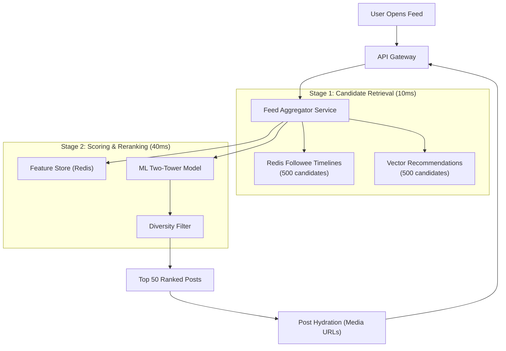

# High-Level Design: News Feed Ranking System

## 🏗️ 1. Multi-Stage Ranking Architecture

---

## ⚡ 2. The Hybrid Fan-out Pattern
- **Standard Users**: **Fan-out on Write** (injected directly into followers' Redis timeline cache).
- **Celebrities (> 50k Followers)**: **Fan-out on Read** (pulled dynamically during candidate retrieval and merged with cached timelines in memory).
