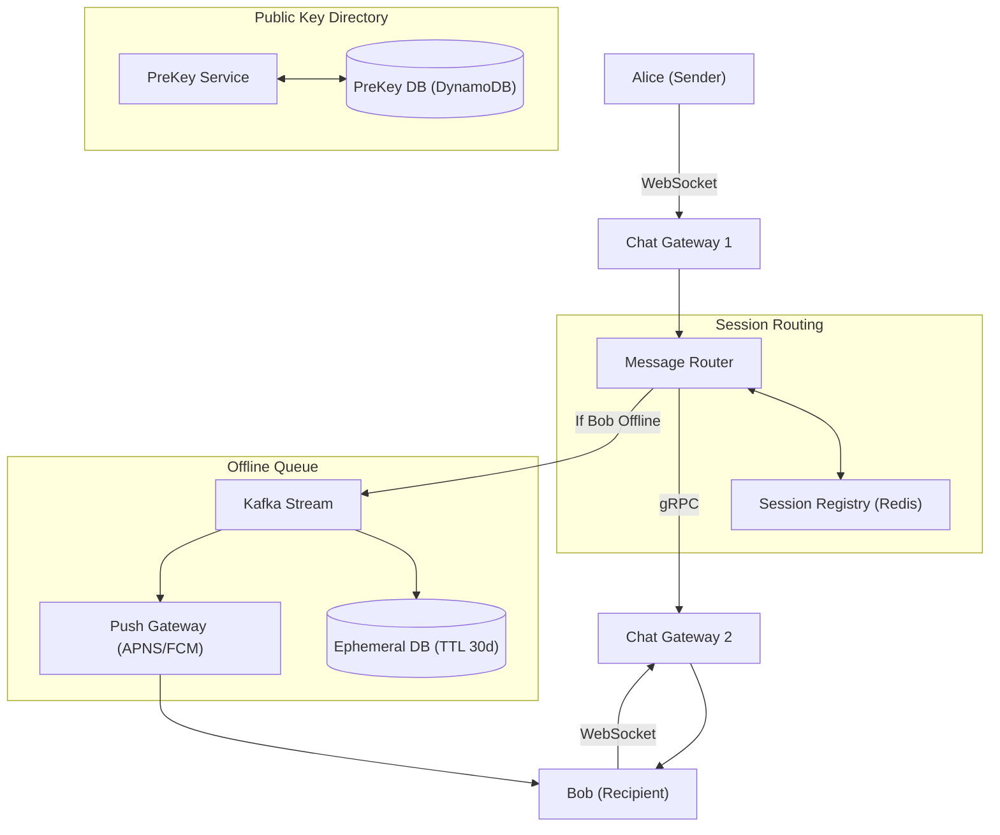

# High-Level Design: E2E-Encrypted Messaging System

## 🏗️ 1. High-Level Architecture

---

## 🔒 2. Signal Protocol Cryptographic Primitives: X3DH & Double Ratchet
1. **X3DH (Extended Triple Diffie-Hellman)**: Establishes a shared secret key between Alice and Bob even if Bob is offline, using pre-published public Identity keys and One-Time PreKeys.
2. **Double Ratchet**: Derives a new symmetric encryption key for **every single message**. If an attacker intercepts the key for message #5, they still cannot decrypt message #6 (Forward Secrecy & Break-in Recovery)!
