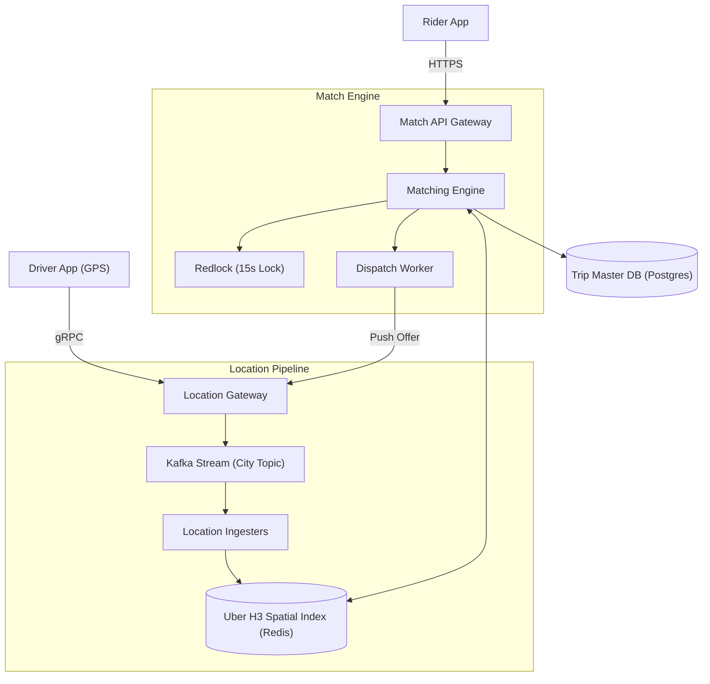

# High-Level Design: Real-Time Ride-Matching Engine

## 🏗️ 1. High-Level Architecture

---

## 🗺️ 2. Spatial Indexing: Why Uber Uses Hexagons (H3)
- In a square grid, diagonal cells are $\sqrt{2}\times$ further away than orthogonal neighbors.
- In **Uber H3 Hexagonal Grid**, all 6 neighboring cells are at the exact same geographic distance, eliminating direction bias in distance computations and k-ring radius expansions!
