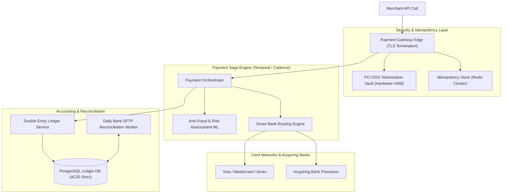
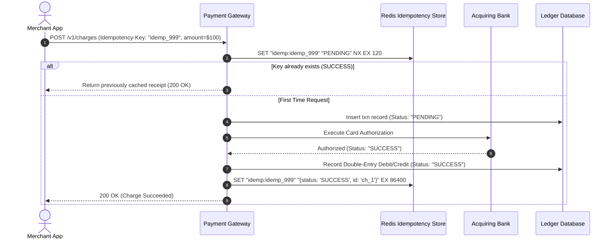

# High-Level Design: Idempotent Payment Processing System

## 🏗️ 1. High-Level Architecture

```mermaid
flowchart TD
    Merchant["Merchant API Call"] --> Gateway["Payment Gateway Edge (TLS Termination)"]

    subgraph SecurityTier["Security & Idempotency Layer"]
        Gateway --> TokenVault["PCI-DSS Tokenization Vault (Hardware HSM)"]
        Gateway --> IdempStore["Idempotency Store (Redis Cluster)"]
    end

    subgraph SagaOrchestrationTier["Payment Saga Engine (Temporal / Cadence)"]
        Gateway --> Orchestrator["Payment Orchestrator"]
        Orchestrator --> RiskEngine["Anti-Fraud & Risk Assessment ML"]
        Orchestrator --> BankRouter["Smart Bank Routing Engine"]
    end

    subgraph ExternalRails["Card Networks & Acquiring Banks"]
        BankRouter --> VisaMastercard["Visa / Mastercard / Amex"]
        BankRouter --> Acquirer["Acquiring Bank Processor"]
    end

    subgraph LedgerTier["Accounting & Reconciliation"]
        Orchestrator --> LedgerSvc["Double-Entry Ledger Service"]
        LedgerSvc --> LedgerDB[("PostgreSQL Ledger DB (ACID Strict)")]
        ReconcileWorker["Daily Bank SFTP Reconciliation Worker"]
        ReconcileWorker <--> LedgerDB
    end
```

---

## 🔒 2. Idempotency State Transition Flow

```mermaid
sequenceDiagram
    autonumber
    actor Merchant as Merchant App
    participant PG as Payment Gateway
    participant Redis as Redis Idempotency Store
    participant Bank as Acquiring Bank
    participant DB as Ledger Database

    Merchant->>PG: POST /v1/charges (Idempotency-Key: "idemp_999", amount=$100)
    PG->>Redis: SET "idemp:idemp_999" "PENDING" NX EX 120
    alt Key already exists (SUCCESS)
        PG-->>Merchant: Return previously cached receipt (200 OK)
    else First Time Request
        PG->>DB: Insert txn record (Status: "PENDING")
        PG->>Bank: Execute Card Authorization
        Bank-->>PG: Authorized (Status: "SUCCESS")
        PG->>DB: Record Double-Entry Debit/Credit (Status: "SUCCESS")
        PG->>Redis: SET "idemp:idemp_999" "{status: 'SUCCESS', id: 'ch_1'}" EX 86400
        PG-->>Merchant: 200 OK (Charge Succeeded)
    end
```
