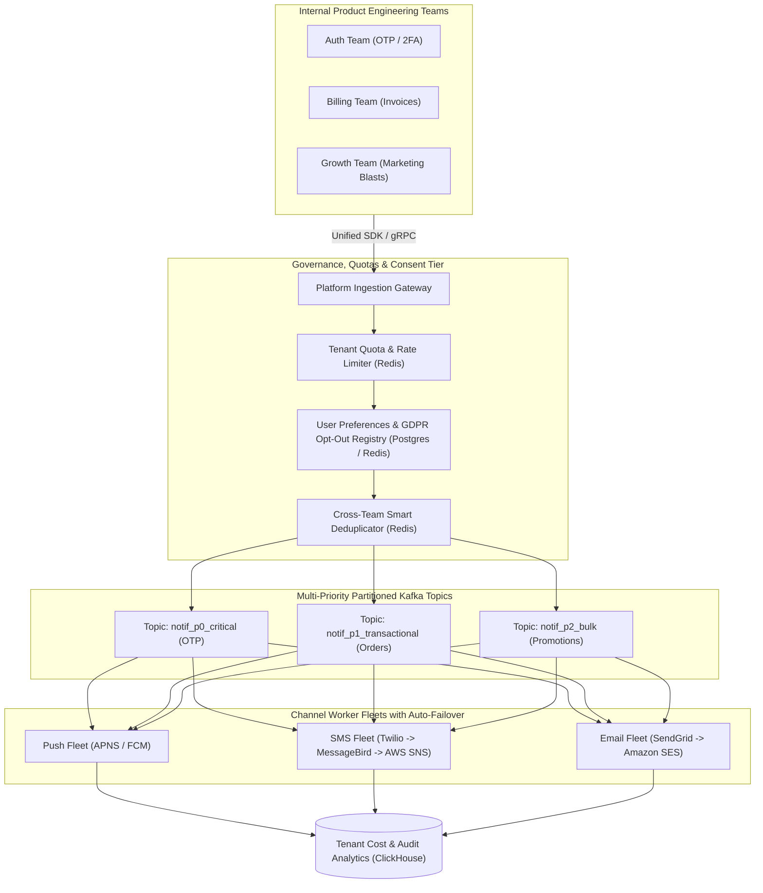

# High-Level Design: Company-Wide Notification Platform

## 🏗️ 1. Multi-Tenant Platform Architecture

```mermaid
flowchart TD
    subgraph InternalTenants["Internal Product Engineering Teams"]
        T1["Auth Team (OTP / 2FA)"]
        T2["Billing Team (Invoices)"]
        T3["Growth Team (Marketing Blasts)"]
    end

    InternalTenants -->|Unified SDK / gRPC| IngestGW["Platform Ingestion Gateway"]

    subgraph GovernanceTier["Governance, Quotas & Consent Tier"]
        IngestGW --> QuotaEnforcer["Tenant Quota & Rate Limiter (Redis)"]
        QuotaEnforcer --> ConsentStore["User Preferences & GDPR Opt-Out Registry (Postgres / Redis)"]
        ConsentStore --> Deduplicator["Cross-Team Smart Deduplicator (Redis)"]
    end

    subgraph PriorityStreamingTier["Multi-Priority Partitioned Kafka Topics"]
        Deduplicator --> P0["Topic: notif_p0_critical (OTP)"]
        Deduplicator --> P1["Topic: notif_p1_transactional (Orders)"]
        Deduplicator --> P2["Topic: notif_p2_bulk (Promotions)"]
    end

    subgraph MultiVendorWorkerFleet["Channel Worker Fleets with Auto-Failover"]
        P0 & P1 & P2 --> PushFleet["Push Fleet (APNS / FCM)"]
        P0 & P1 & P2 --> SMSFleet["SMS Fleet (Twilio -> MessageBird -> AWS SNS)"]
        P0 & P1 & P2 --> EmailFleet["Email Fleet (SendGrid -> Amazon SES)"]
    end

    PushFleet & SMSFleet & EmailFleet --> TelemetryDB[("Tenant Cost & Audit Analytics (ClickHouse)")]
```
