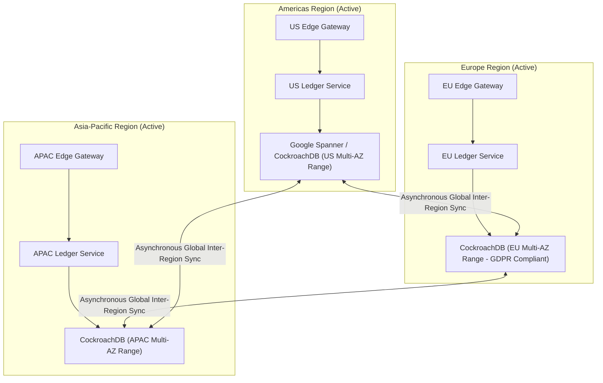

# High-Level Design: Global Active-Active Payments Ledger

## 🏗️ 1. Multi-Region Active-Active Architecture

---

## ⚡ 2. The Locality-Aware Account Range Strategy
- By partitioning ledger account rows using **Locality Constraints** (`account_country = 'DE' -> store in EU-Frankfurt cluster`):
  - Local domestic payments commit with strict ACID serializability within local datacenter AZs in **`< 10ms`**.
  - No cross-continental network latency for 98% of world payments!
