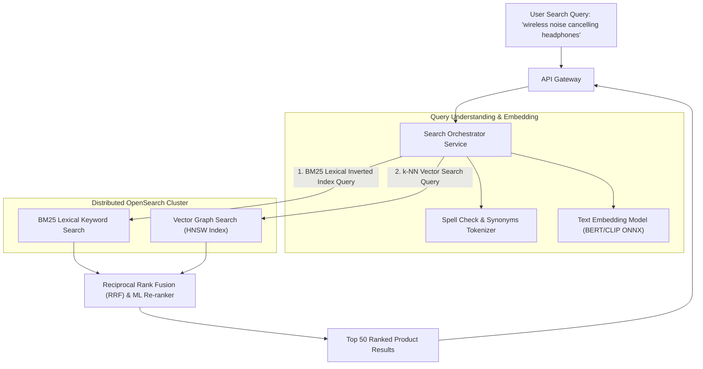

# High-Level Design: Enterprise Search Infrastructure

## 🏗️ 1. Hybrid Lexical + Vector Search Architecture

```mermaid
flowchart TD
    UserQuery["User Search Query: 'wireless noise cancelling headphones'"] --> Gateway["API Gateway"]
    Gateway --> SearchService["Search Orchestrator Service"]

    subgraph QueryProcessing["Query Understanding & Embedding"]
        SearchService --> NLPParser["Spell Check & Synonyms Tokenizer"]
        SearchService --> EmbeddingModel["Text Embedding Model (BERT/CLIP ONNX)"]
    end

    subgraph SearchTier["Distributed OpenSearch Cluster"]
        SearchService -->|1. BM25 Lexical Inverted Index Query| LexicalSearch["BM25 Lexical Keyword Search"]
        SearchService -->|2. k-NN Vector Search Query| VectorSearch["Vector Graph Search (HNSW Index)"]
    end

    LexicalSearch & VectorSearch --> HybridRanker["Reciprocal Rank Fusion (RRF) & ML Re-ranker"]
    HybridRanker --> TopResults["Top 50 Ranked Product Results"]
    TopResults --> Gateway
```
