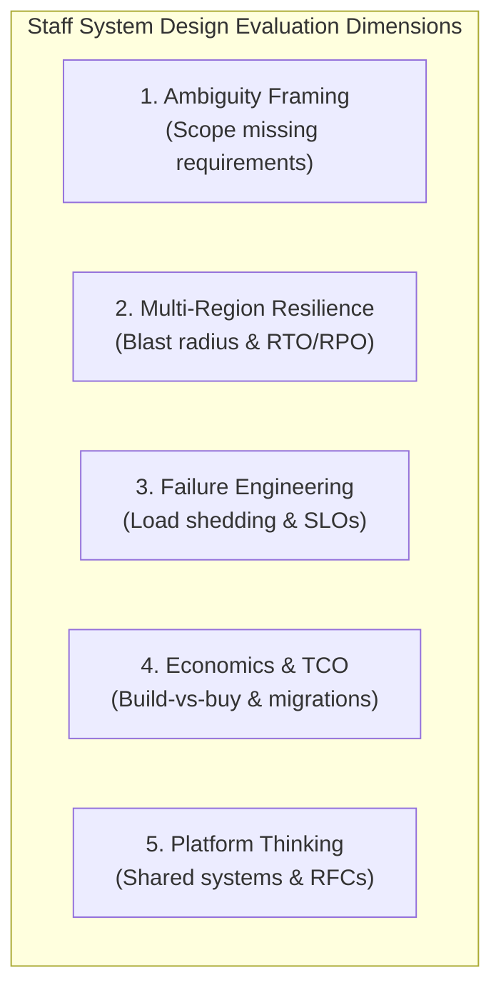

# 🚀 Striver-Style HLD — Senior & Staff-Level System Design

[](https://github.com/Sourav108/strivers-lld)
[](https://github.com/Sourav108/strivers-lld)
[](https://github.com/Sourav108/strivers-lld)

> **Companion to [strivers-lld](https://github.com/Sourav108/strivers-lld).**  
> Upgraded from a standard mid-level HLD roadmap to match what **Senior (L5)**, **Staff (L6)**, and **Principal (L7)** loops actually test: **ambiguity framing, multi-region active-active scale, cost/TCO trade-offs, operational depth, chaos engineering, and cross-team/platform thinking** — not just *"does it scale"*.

---

## 🏛️ The Staff+ Evaluation Matrix: What Bar-Raisers Actually Score



---

## 📚 Master Curriculum (19 Sections)

### 🧱 Part 1: Core Architectural Foundations & Trade-offs
| # | Section | Key Senior/Staff Concepts | Documentation |
|---|---|---|---|
| **01** | **[Introduction to HLD](./01-Introduction-to-HLD)** | Framing Ambiguity, Client-Server Model, 45-min Staff Framework | [Notes](./01-Introduction-to-HLD/README.md) • [Case Study](./01-Introduction-to-HLD/case-study.md) • [Scale Follow-ups](./01-Introduction-to-HLD/scale-followups.md) • [When Not To Use](./01-Introduction-to-HLD/when-not-to-use.md) |
| **02** | **[Networking Fundamentals](./02-Networking-Fundamentals)** | OSI/TCP-IP, DNS Anycast, HTTP/3 (QUIC), WebSockets, gRPC vs REST | [Notes](./02-Networking-Fundamentals/README.md) • [Case Study](./02-Networking-Fundamentals/case-study.md) • [Scale Follow-ups](./02-Networking-Fundamentals/scale-followups.md) • [When Not To Use](./02-Networking-Fundamentals/when-not-to-use.md) |
| **03** | **[Scalability & Reliability](./03-Scalability-and-Reliability)** | Availability Math (99.999%), Failure Domains, Active-Active Failover | [Notes](./03-Scalability-and-Reliability/README.md) • [Case Study](./03-Scalability-and-Reliability/case-study.md) • [Scale Follow-ups](./03-Scalability-and-Reliability/scale-followups.md) • [When Not To Use](./03-Scalability-and-Reliability/when-not-to-use.md) |
| **04** | **[Load Balancing & Proxies](./04-Load-Balancing-and-Proxies)** | L4 vs L7 LB, Reverse Proxy, Envoy Service Mesh, API Gateway | [Notes](./04-Load-Balancing-and-Proxies/README.md) • [Case Study](./04-Load-Balancing-and-Proxies/case-study.md) • [Scale Follow-ups](./04-Load-Balancing-and-Proxies/scale-followups.md) • [When Not To Use](./04-Load-Balancing-and-Proxies/when-not-to-use.md) |
| **05** | **[Caching](./05-Caching)** | Cache-Aside, Write-Back, LRU/LFU, CDN Edge, Stampede/Penetration | [Notes](./05-Caching/README.md) • [Case Study](./05-Caching/case-study.md) • [Scale Follow-ups](./05-Caching/scale-followups.md) • [When Not To Use](./05-Caching/when-not-to-use.md) |
| **06** | **[Databases & Storage](./06-Databases-and-Storage)** | SQL vs NoSQL, B-Trees vs LSM, Replication, Data Residency & GDPR | [Notes](./06-Databases-and-Storage/README.md) • [Case Study](./06-Databases-and-Storage/case-study.md) • [Scale Follow-ups](./06-Databases-and-Storage/scale-followups.md) • [When Not To Use](./06-Databases-and-Storage/when-not-to-use.md) |
| **07** | **[Data Partitioning & Consistent Hashing](./07-Data-Partitioning-and-Consistent-Hashing)** | Sharding, Consistent Hashing (Vnodes), Quorum (N,R,W), Bloom Filters | [Notes](./07-Data-Partitioning-and-Consistent-Hashing/README.md) • [Case Study](./07-Data-Partitioning-and-Consistent-Hashing/case-study.md) • [Scale Follow-ups](./07-Data-Partitioning-and-Consistent-Hashing/scale-followups.md) • [When Not To Use](./07-Data-Partitioning-and-Consistent-Hashing/when-not-to-use.md) |
| **08** | **[Messaging & Event-Driven Systems](./08-Messaging-and-Event-Driven-Systems)** | Kafka Internals (Zero-Copy), Consumer Groups, Event Sourcing, CQRS | [Notes](./08-Messaging-and-Event-Driven-Systems/README.md) • [Case Study](./08-Messaging-and-Event-Driven-Systems/case-study.md) • [Scale Follow-ups](./08-Messaging-and-Event-Driven-Systems/scale-followups.md) • [When Not To Use](./08-Messaging-and-Event-Driven-Systems/when-not-to-use.md) |
| **09** | **[Microservices & API Design](./09-Microservices-and-API-Design)** | Service Discovery, Circuit Breaker, Saga Pattern, Deprecation Strategy | [Notes](./09-Microservices-and-API-Design/README.md) • [Case Study](./09-Microservices-and-API-Design/case-study.md) • [Scale Follow-ups](./09-Microservices-and-API-Design/scale-followups.md) • [When Not To Use](./09-Microservices-and-API-Design/when-not-to-use.md) |
| **10** | **[Distributed Systems](./10-Distributed-Systems)** | Paxos/Raft, Leader Election, Redlock, PACELC, Exactly-Once Semantics | [Notes](./10-Distributed-Systems/README.md) • [Case Study](./10-Distributed-Systems/case-study.md) • [Scale Follow-ups](./10-Distributed-Systems/scale-followups.md) • [When Not To Use](./10-Distributed-Systems/when-not-to-use.md) |

---

### 🛡️ Part 2: Advanced Staff-Level Architecture & Technical Strategy
| # | Section | Key Senior/Staff Concepts | Documentation |
|---|---|---|---|
| **11** | **[Security & Compliance](./11-Security-and-Compliance)** | AuthN/AuthZ, OAuth2/JWT, Data Sovereignty, Zero-Trust mTLS, Rate Limiting | [Notes](./11-Security-and-Compliance/README.md) • [Case Study](./11-Security-and-Compliance/case-study.md) • [Scale Follow-ups](./11-Security-and-Compliance/scale-followups.md) • [When Not To Use](./11-Security-and-Compliance/when-not-to-use.md) |
| **12** | **[Observability & Reliability Engineering](./12-Observability-and-Reliability-Engineering)** | Distributed Tracing, SLI/SLO & Error Budgets, Alerting Fatigue, Postmortems | [Notes](./12-Observability-and-Reliability-Engineering/README.md) • [Case Study](./12-Observability-and-Reliability-Engineering/case-study.md) • [Scale Follow-ups](./12-Observability-and-Reliability-Engineering/scale-followups.md) • [When Not To Use](./12-Observability-and-Reliability-Engineering/when-not-to-use.md) |
| **13** | **[Multi-Region & Global Scale](./13-Multi-Region-and-Global-Scale)** | Active-Active vs Active-Passive, CRDTs, Anycast Latency Routing, RTO/RPO | [Notes](./13-Multi-Region-and-Global-Scale/README.md) • [Case Study](./13-Multi-Region-and-Global-Scale/case-study.md) • [Scale Follow-ups](./13-Multi-Region-and-Global-Scale/scale-followups.md) • [When Not To Use](./13-Multi-Region-and-Global-Scale/when-not-to-use.md) |
| **14** | **[Operational Excellence & Failure Engineering](./14-Operational-Excellence-and-Failure-Engineering)** | Chaos Engineering, Graceful Degradation, Backpressure, Blast Radius Containment | [Notes](./14-Operational-Excellence-and-Failure-Engineering/README.md) • [Case Study](./14-Operational-Excellence-and-Failure-Engineering/case-study.md) • [Scale Follow-ups](./14-Operational-Excellence-and-Failure-Engineering/scale-followups.md) • [When Not To Use](./14-Operational-Excellence-and-Failure-Engineering/when-not-to-use.md) |
| **15** | **[Cost, Build-vs-Buy & Technical Strategy](./15-Cost-Build-vs-Buy-and-Technical-Strategy)** | Total Cost of Ownership (TCO), Vendor Lock-in, Strangler Fig Migration, Tech Debt | [Notes](./15-Cost-Build-vs-Buy-and-Technical-Strategy/README.md) • [Case Study](./15-Cost-Build-vs-Buy-and-Technical-Strategy/case-study.md) • [Scale Follow-ups](./15-Cost-Build-vs-Buy-and-Technical-Strategy/scale-followups.md) • [When Not To Use](./15-Cost-Build-vs-Buy-and-Technical-Strategy/when-not-to-use.md) |
| **16** | **[Org-Level Platform Thinking & Communication](./16-Org-Level-Platform-Thinking-and-Communication)** | Multi-Tenant Shared Platforms, Writing High-Impact RFCs, Defending Trade-offs | [Notes](./16-Org-Level-Platform-Thinking-and-Communication/README.md) • [Case Study](./16-Org-Level-Platform-Thinking-and-Communication/case-study.md) • [Scale Follow-ups](./16-Org-Level-Platform-Thinking-and-Communication/scale-followups.md) • [When Not To Use](./16-Org-Level-Platform-Thinking-and-Communication/when-not-to-use.md) |

---

### 🎯 Part 3: Real-World Interview Problems (Graded for Staff Signals)

#### 17. Core Systems at Extreme Scale
- **[17.1 URL Shortener @ 1B Users](./17-Interview-Problems-Core-Systems/01-URL-Shortener-at-1B-Users)**: KGS clusters, multi-region cache invalidation, custom aliases.
- **[17.2 Multi-Tenant Distributed Rate Limiter](./17-Interview-Problems-Core-Systems/02-Multi-Tenant-Rate-Limiter)**: Tiered quotas, noisy neighbor isolation, Redis Lua scripts.
- **[17.3 Distributed Key-Value Store](./17-Interview-Problems-Core-Systems/03-Distributed-Key-Value-Store)**: Dynamo ring topology, Quorum tunability, Hinted Handoff.
- **[17.4 Distributed Web Crawler](./17-Interview-Problems-Core-Systems/04-Distributed-Web-Crawler)**: URL Frontier, politeness host queues, Bloom filter deduplication.

#### 18. Product-Scale Systems
- **[18.1 News Feed Ranking System](./18-Interview-Problems-Product-Scale/01-News-Feed-Ranking-System)**: Hybrid push-pull, ML scoring pipelines, celebrity hotkey bypass.
- **[18.2 E2E-Encrypted Messaging System](./18-Interview-Problems-Product-Scale/02-E2E-Encrypted-Messaging-System)**: Double Ratchet protocol, ephemeral message queues, WebSockets.
- **[18.3 Real-Time Ride-Matching Engine](./18-Interview-Problems-Product-Scale/03-Real-Time-Ride-Matching-Engine)**: Uber H3 spatial hexagons, distributed lock dispatching.
- **[18.4 Idempotent Payment Processing System](./18-Interview-Problems-Product-Scale/04-Idempotent-Payment-Processing-System)**: Saga orchestration, double-entry ledger, reconciliation.

#### 19. Staff-Scope & Ambiguous Problems
- **[19.1 Company-Wide Notification Platform](./19-Interview-Problems-Staff-Scope/01-Company-Wide-Notification-Platform)**: Multi-tenant platform, template engine, vendor failover, org SLA.
- **[19.2 Zero-Downtime Monolith to Microservices Migration](./19-Interview-Problems-Staff-Scope/02-Zero-Downtime-Monolith-to-Microservices-Migration)**: Strangler Fig, CDC replication, dual-writing, dark launching.
- **[19.3 Global Active-Active Payments Ledger](./19-Interview-Problems-Staff-Scope/03-Global-Active-Active-Payments-Ledger)**: Cross-region replication, conflict resolution, TrueTime/Spanner.
- **[19.4 Build-vs-Buy Enterprise Search Infrastructure](./19-Interview-Problems-Staff-Scope/04-Build-vs-Buy-Enterprise-Search-Infrastructure)**: Elasticsearch vs Algolia vs Custom Lucene, TCO analysis.
- **[19.5 Org-Wide Experimentation & Feature Flag Platform](./19-Interview-Problems-Staff-Scope/05-Org-Wide-Experimentation-Feature-Flag-Platform)**: Statistical confidence, ultra-low latency SDK evaluation.

---

## 🛠️ Repository Standard Deliverables

```
Concept Modules (01–16):
├── README.md            # Concept notes framed around trade-offs & decision vectors
├── case-study.md        # Production architecture from Netflix, Uber, Discord, Stripe, etc.
├── scale-followups.md   # What changes at 10x/100x scale or across multi-region topologies
└── when-not-to-use.md   # Anti-patterns, complexity traps, and when to avoid this technology

Interview Problems (17–19):
├── requirements.md      # Staff-style prompt (deliberately under-specified for Section 19)
├── capacity-estimate.md # Back-of-the-envelope math (Traffic QPS, Storage, Memory, Bandwidth)
├── README.md            # Complete High-Level Design, Data Model, Component Deep Dives
├── tradeoffs.md         # Trade-offs matrix and alternatives considered
├── staff-signals.md     # Specific grading criteria: Ambiguity, Cost, Pushback, Blast-Radius
└── org-constraints.md   # (Section 19 only) Team skill sets, migration strategy, TCO budgets
```
