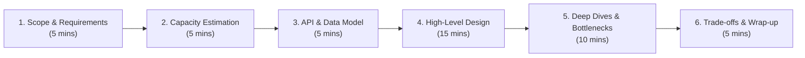

# 🚀 Striver HLD — High Level Design (System Design)

[](https://github.com/Sourav108/strivers-lld)
[](https://github.com/Sourav108/strivers-lld)
[](https://opensource.org/licenses/MIT)

> **The ultimate companion to [strivers-lld](https://github.com/Sourav108/strivers-lld).**  
> While Low-Level Design (LLD) focuses on object-oriented programming, clean code, design patterns, and SOLID principles, **High-Level Design (HLD)** addresses large-scale distributed architectures, scalability, high availability, fault tolerance, data partitioning, and real-world system design interview problems.

---

## 🧭 System Design Interview Framework (The 45-Minute Playbook)



---

## 📚 Curriculum Roadmap

| # | Section | Key Topics & Architecture Highlights | Documentation |
|---|---|---|---|
| **01** | **[Introduction to HLD](./01-Introduction-to-HLD)** | HLD vs LLD, Client-Server Model, 45-min Interview Framework | [Notes](./01-Introduction-to-HLD/README.md) • [Case Study](./01-Introduction-to-HLD/case-study.md) |
| **02** | **[Networking Fundamentals](./02-Networking-Fundamentals)** | OSI & TCP/IP, DNS, HTTP/1.1 vs HTTP/2 vs HTTP/3, WebSockets, REST vs GraphQL vs gRPC | [Notes](./02-Networking-Fundamentals/README.md) • [Case Study](./02-Networking-Fundamentals/case-study.md) |
| **03** | **[Scalability & Reliability](./03-Scalability-and-Reliability)** | Vertical vs Horizontal, High Availability (99.999%), Redundancy, Active-Active Failover | [Notes](./03-Scalability-and-Reliability/README.md) • [Case Study](./03-Scalability-and-Reliability/case-study.md) |
| **04** | **[Load Balancing & Proxies](./04-Load-Balancing-and-Proxies)** | L4 vs L7, Algorithms (Round Robin, Least Connections, IP Hash), Reverse Proxy, API Gateway | [Notes](./04-Load-Balancing-and-Proxies/README.md) • [Case Study](./04-Load-Balancing-and-Proxies/case-study.md) |
| **05** | **[Caching](./05-Caching)** | Cache-Aside, Write-Through/Back/Around, Eviction (LRU/LFU), Redis vs Memcached, CDN | [Notes](./05-Caching/README.md) • [Case Study](./05-Caching/case-study.md) |
| **06** | **[Databases & Storage](./06-Databases-and-Storage)** | SQL vs NoSQL, B-Trees vs LSM-Trees, Replication, CAP & PACELC, ACID vs BASE | [Notes](./06-Databases-and-Storage/README.md) • [Case Study](./06-Databases-and-Storage/case-study.md) |
| **07** | **[Data Partitioning & Consistent Hashing](./07-Data-Partitioning-and-Consistent-Hashing)** | Sharding Strategies, Consistent Hashing (Virtual Nodes), Quorum (N,R,W), Bloom Filters | [Notes](./07-Data-Partitioning-and-Consistent-Hashing/README.md) • [Case Study](./07-Data-Partitioning-and-Consistent-Hashing/case-study.md) |
| **08** | **[Messaging & Event-Driven Systems](./08-Messaging-and-Event-Driven-Systems)** | Pub-Sub, Message Queues (Kafka vs RabbitMQ vs SQS), Event Sourcing, CQRS | [Notes](./08-Messaging-and-Event-Driven-Systems/README.md) • [Case Study](./08-Messaging-and-Event-Driven-Systems/case-study.md) |
| **09** | **[Microservices & API Design](./09-Microservices-and-API-Design)** | Monolith vs Microservices, Service Discovery, Circuit Breaker, Saga Pattern | [Notes](./09-Microservices-and-API-Design/README.md) • [Case Study](./09-Microservices-and-API-Design/case-study.md) |
| **10** | **[Distributed Systems](./10-Distributed-Systems)** | Consensus (Paxos/Raft), Leader Election, Distributed Locks, Idempotency, Vector Clocks | [Notes](./10-Distributed-Systems/README.md) • [Case Study](./10-Distributed-Systems/case-study.md) |
| **11** | **[Security](./11-Security)** | AuthN vs AuthZ, OAuth 2.0 / JWT, SSL/TLS & mTLS, Rate Limiting, DDoS Mitigation | [Notes](./11-Security/README.md) • [Case Study](./11-Security/case-study.md) |
| **12** | **[Observability](./12-Observability)** | Metrics, Logs, Distributed Tracing (OpenTelemetry/Jaeger), SLA/SLO/SLI, Alerting | [Notes](./12-Observability/README.md) • [Case Study](./12-Observability/case-study.md) |
| **13** | **[Best Practices in HLD](./13-Best-Practices-in-HLD)** | Capacity Estimation Math Cheat Sheet, Numbers Every Engineer Should Know, Trade-off Matrix | [Notes](./13-Best-Practices-in-HLD/README.md) • [Case Study](./13-Best-Practices-in-HLD/case-study.md) |

---

## 🎯 Top System Design Interview Problems

### Part 1: Core Scalable Systems & Utilities
- **[14.1 URL Shortener (TinyURL)](./14-Interview-Problems-Part-1/01-URL-Shortener)**: Base62 encoding, Key Generation Service (KGS), high-read Redis cache tier.
- **[14.2 Distributed Rate Limiter](./14-Interview-Problems-Part-1/02-Rate-Limiter)**: Sliding Window Counter in Redis Lua scripts, Token Bucket, API Gateway middleware.
- **[14.3 Pastebin / Gist Service](./14-Interview-Problems-Part-1/03-Pastebin)**: Object storage (S3), metadata SQL/NoSQL store, TTL automated cleanup.
- **[14.4 Distributed Web Crawler](./14-Interview-Problems-Part-1/04-Web-Crawler)**: URL Frontier, Politeness & DNS caching, Bloom Filters for deduplication.
- **[14.5 Distributed Key-Value Store](./14-Interview-Problems-Part-1/05-Distributed-Key-Value-Store)**: Dynamo-style ring, Consistent Hashing, Quorum reads/writes, Gossip Protocol.

### Part 2: Social Media, Messaging & Financial Platforms
- **[15.1 Twitter / News Feed System](./15-Interview-Problems-Part-2/01-Twitter-Feed-System)**: Fan-out on write vs Fan-out on read, hybrid celebrity fan-out model.
- **[15.2 Instagram Media Service](./15-Interview-Problems-Part-2/02-Instagram)**: Media ingestion pipeline, image resizing, CDN edge delivery, metadata sharding.
- **[15.3 WhatsApp / Messenger](./15-Interview-Problems-Part-2/03-WhatsApp-Chat)**: Persistent WebSockets, Gateway routing, Cassandra store, E2E encryption.
- **[15.4 Distributed Notification System](./15-Interview-Problems-Part-2/04-Notification-System)**: Priority Queues, multi-channel delivery (Push/SMS/Email), rate limiting, idempotency.
- **[15.5 Splitwise Expense Sharing](./15-Interview-Problems-Part-2/05-Splitwise)**: Group ledger, transactional consistency, Debt Simplification Graph Algorithm.

### Part 3: Real-Time, Streaming & Mission-Critical Systems
- **[16.1 Uber / Ride Hailing System](./16-Interview-Problems-Part-3/01-Uber-Ride-Matching)**: Geospatial indexing (Geohash / QuadTree / Google S2), Driver dispatch engine.
- **[16.2 YouTube / Netflix Streaming](./16-Interview-Problems-Part-3/02-YouTube-Netflix-Streaming)**: Video chunking & transcoding pipeline, Adaptive Bitrate Streaming (HLS/DASH), CDN caching.
- **[16.3 Google Docs Collaborative Editor](./16-Interview-Problems-Part-3/03-Google-Docs-Collaborative-Editor)**: Real-time synchronization, Operational Transformation (OT) vs CRDTs, WebSockets.
- **[16.4 Distributed Cache System](./16-Interview-Problems-Part-3/04-Distributed-Cache)**: LRU/LFU eviction, consistent hashing, replication, write-back & invalidation.
- **[16.5 High-Throughput Payment Gateway](./16-Interview-Problems-Part-3/05-Payment-Gateway)**: Distributed 2PC / Saga Orchestration, Idempotency keys, Double-entry ledger, Reconciliation.

---

## 🛠 Repository Standard Template

Every section follows a rigorous architecture-first structure:

```
Concept Modules (01–13):
├── README.md        # Deep dive explanation, architectural principles, comparisons, diagrams
└── case-study.md    # Real-world engineering case study (Netflix, Uber, Discord, etc.)

Interview Problems (14–16):
├── requirements.md       # Functional & Non-Functional requirements, API definitions
├── capacity-estimate.md  # Back-of-the-envelope calculations (Traffic, Storage, RAM, Bandwidth)
├── README.md             # Complete High-Level Design, Data Model, Component Deep Dives
└── tradeoffs.md          # Architectural trade-offs, bottlenecks, failure modes & mitigations
```

---

## 🤝 Companion Repository

Looking for Object-Oriented Design, SOLID principles, design patterns, and low-level Java implementations? Check out the sister repository:  
👉 **[Sourav108/strivers-lld](https://github.com/Sourav108/strivers-lld)**
